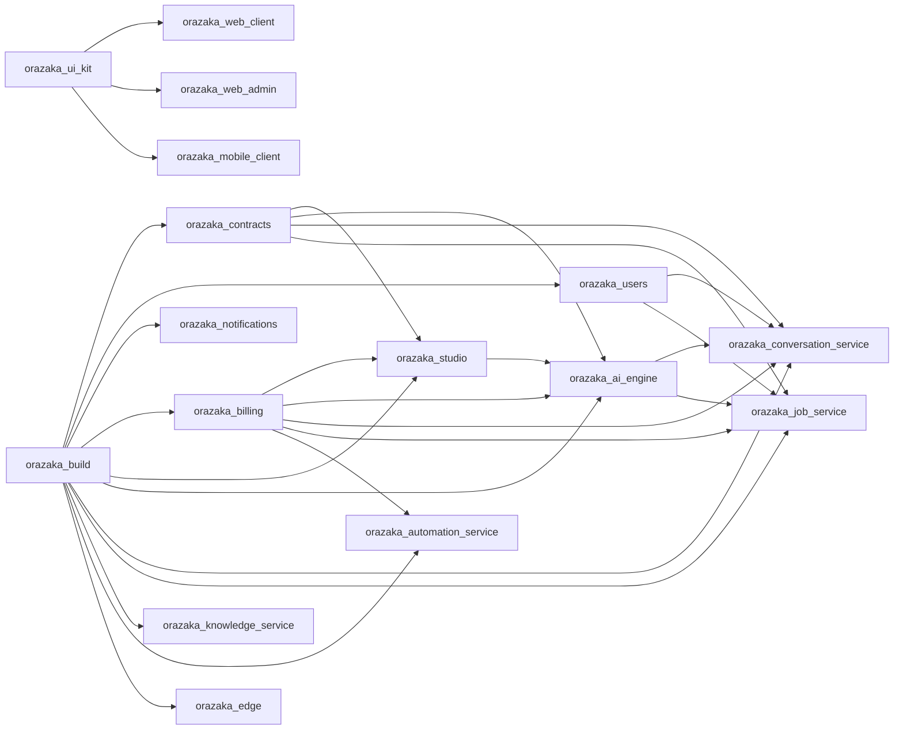

# Orazaka

> Sovereign AI platform by [Krizaka](https://krizaka.com) — and the **workspace** that assembles it.

This repository is the entry point of the Orazaka platform. It holds the governance contract
([AGENTS.md](AGENTS.md)), the workspace manifest ([`orazaka.workspace.json`](orazaka.workspace.json)),
the local infrastructure (`infra/`), the hermetic end-to-end suite (`orazaka-end2end/`) and the
architecture documentation (`docs/`). Every component lives in its own repository so that any
Krizaka application can pick only what it needs.

## Repositories

### Foundation — reusable by any application

| Repository | What it is |
|:---|:---|
| [`orazaka-build`](https://github.com/krizaka/orazaka-build) | Parent POM (Spring Boot / Spring AI BOMs, plugin management, Orazaka BOM) and the shared governance test kit (ArchUnit rules, Testcontainers base) for every Orazaka JVM repository. |
| [`orazaka-contracts`](https://github.com/krizaka/orazaka-contracts) | Tier-1 platform contracts shared by every Orazaka service: the job plane (jobs-api) and the application-persistence ports (persistence-app-api). Pure interfaces and records, zero implementation. |
| [`orazaka-edge`](https://github.com/krizaka/orazaka-edge) | Transparent HTTP edge in front of every Orazaka service: routing, API-key → JWT exchange, CORS and tracing. Spring MVC + virtual threads. |
| [`orazaka-ui-kit`](https://github.com/krizaka/orazaka-ui-kit) | @krizaka/orazaka-shared (TypeScript types, Zod schemas, design tokens) and @krizaka/orazaka-design-system (React components, Tailwind preset, theme, icon registry) for Next.js and React Native apps. |

### Domain services — reusable by any application

| Repository | What it is |
|:---|:---|
| [`orazaka-users`](https://github.com/krizaka/orazaka-users) | Reusable user management for any Krizaka application: registration, e-mail verification, login (password + Google/GitHub OAuth), forgot/reset password, profile & preferences, API keys, RBAC and JWT issuance. |
| [`orazaka-notifications`](https://github.com/krizaka/orazaka-notifications) | Channel-based notification delivery for any Krizaka application: e-mail (SMTP), SMS (Twilio) and webhooks behind one DeliveryClient port, driven by platform events (user registered, password reset) or explicit notification requests over AMQP. |
| [`orazaka-billing`](https://github.com/krizaka/orazaka-billing) | Credits, wallets, plans, subscriptions, pricebook and metering (hold → settle → release) as a reusable billing service, with its contract (billing-api) and a typed HTTP client (billing-client). |

### Orazaka AI engine

| Repository | What it is |
|:---|:---|
| [`orazaka-studio`](https://github.com/krizaka/orazaka-studio) | Studio & pack marketplace: pack catalogue, studio blueprints, installations and saga-driven runs, with its contract (studio-api) and HTTP client (studio-client). |
| [`orazaka-ai-engine`](https://github.com/krizaka/orazaka-ai-engine) | The Orazaka cognitive SDK: AiClient & provider mesh (core), the interceptor pipeline, tools (MCP · RAG · sandbox), use-case orchestration (business), application persistence and asset encryption. |
| [`orazaka-conversation-service`](https://github.com/krizaka/orazaka-conversation-service) | Interactive ingress of the Orazaka engine: chat (SSE streaming), intents, models, pipeline, MCP and job APIs — translates transport into Intentions, never business logic. |
| [`orazaka-job-service`](https://github.com/krizaka/orazaka-job-service) | Asynchronous job executor of the Orazaka engine: drains the interactive and batch lanes, owns the capability registry and the worker registry. |
| [`orazaka-knowledge-service`](https://github.com/krizaka/orazaka-knowledge-service) | Knowledge & RAG retrieval service (pgvector) with asynchronous indexing. |
| [`orazaka-automation-service`](https://github.com/krizaka/orazaka-automation-service) | Connector automation (Jira, Slack, WhatsApp, Messenger, CLI agents) with Quartz scheduling and execution telemetry. |
| [`orazaka-worker-media`](https://github.com/krizaka/orazaka-worker-media) | Native (Metal) Python worker for image/video generation and media composition, speaking the Orazaka AMQP worker protocol. |

### Applications & content

| Repository | What it is |
|:---|:---|
| [`orazaka-web-client`](https://github.com/krizaka/orazaka-web-client) | Next.js (App Router) client of the Orazaka platform with its mandatory BFF. |
| [`orazaka-web-admin`](https://github.com/krizaka/orazaka-web-admin) | Next.js SecOps & administration console of the Orazaka platform. |
| [`orazaka-mobile-client`](https://github.com/krizaka/orazaka-mobile-client) | Expo / React Native client of the Orazaka platform (talks to the edge with Bearer tokens). |
| [`orazaka-cli`](https://github.com/krizaka/orazaka-cli) | The `orazaka` developer CLI: install, start, dev, test, docs and pack tooling for the Orazaka workspace, with an offline SQLite queue. |
| [`orazaka-packs`](https://github.com/krizaka/orazaka-packs) | Reference packs for the Orazaka Studio marketplace (document validation, media, prospection, real-estate, wellbeing…) and the pack manifest schema. |

## Dependency graph



Rules (AGENTS.md §2): a repository depends only on repositories **before** it in
`orazaka.workspace.json` (no cycle); a service depends on another context's **contract**
(`*-api`) or **client**, never on its implementation.

## Quick start

Requirements: JDK 21, Node.js 22+, Docker, Python 3.11+ (media worker), macOS recommended for native
inference.

```bash
git clone https://github.com/krizaka/orazaka.git && cd orazaka
node scripts/workspace.mjs clone       # clones every repository at its workspace path
./mvnw install                         # builds and tests every JVM repository in one reactor
cd orazaka-apps/ui && npm install      # links @krizaka/* packages from source
npx orazaka install && npx orazaka start && npx orazaka dev
```

`node scripts/workspace.mjs status` shows the branch and state of every repository;
`node scripts/workspace.mjs pull` updates them all.

## Workspace layout

```
orazaka/                               ← this repository
├── AGENTS.md · orazaka.workspace.json · pom.xml (reactor)
├── infra/        docker-compose, initdb (reset + dev fixtures), migrations
├── docs/         architecture, ADRs, generated references
├── orazaka-end2end/                   hermetic E2E
├── orazaka-libs/                      ← cloned: orazaka-build, orazaka-contracts, orazaka-ai-engine
├── orazaka-apps/services/             ← cloned: orazaka-users, orazaka-notifications, orazaka-billing, …
├── orazaka-apps/workers/              ← cloned: orazaka-worker-media
├── orazaka-apps/ui/                   ← npm workspace root; cloned: orazaka-ui-kit, web, mobile, cli
└── orazaka-packs/                     ← cloned: orazaka-packs
```

Cloned directories are ignored by this repository's git; each is its own repository.

## Building a new application from Orazaka components

1. Inherit `com.orazaka:orazaka-parent` (from [orazaka-build](https://github.com/krizaka/orazaka-build)) — same stack,
   versions and quality gates.
2. Run the services you need — e.g. [orazaka-users](https://github.com/krizaka/orazaka-users) for
   registration / login / forgot password / profile, [orazaka-notifications](https://github.com/krizaka/orazaka-notifications)
   for e-mail / SMS / webhook delivery, [orazaka-billing](https://github.com/krizaka/orazaka-billing) for credits and
   subscriptions, [orazaka-edge](https://github.com/krizaka/orazaka-edge) in front of them.
3. Depend only on their contracts (`orazaka-identity-api`, `orazaka-notification-api`,
   `orazaka-billing-api`) or clients.
4. Build the UI with [@krizaka/orazaka-design-system](https://github.com/krizaka/orazaka-ui-kit).

## Consuming packages

Every repository publishes to GitHub Packages on a `v*` tag. Maven, in `~/.m2/settings.xml`:

```xml
<servers>
  <server><id>github</id><username>YOUR_GITHUB_USER</username><password>${env.GITHUB_TOKEN}</password></server>
</servers>
<!-- and a <repository> with id "github" per Orazaka repository you consume, e.g.
     https://maven.pkg.github.com/krizaka/orazaka-build -->
```

npm: `@krizaka:registry=https://npm.pkg.github.com` in `.npmrc`.

## License

Apache License 2.0 — see [LICENSE](LICENSE) and [NOTICE](NOTICE).
