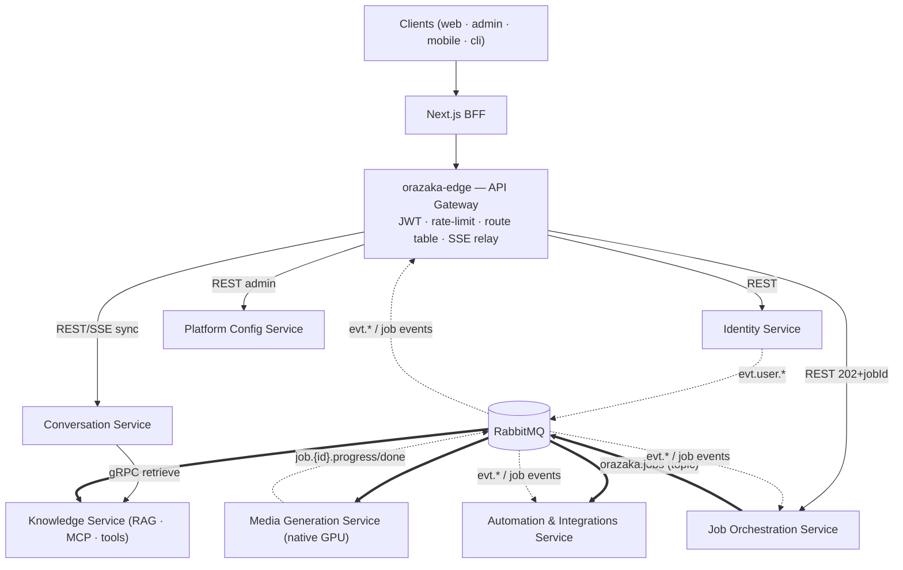

# Orazaka — Microservices Target Architecture

> **Status**: proposal (not yet an ADR). Grounded in `AGENTS.md`, `VISION_ARCHITECTURE.md`, `INTERFACES.md`, `init.sql`, and the actual module tree.
> **Version française : voir seconde moitié du document (§ Version Française).**

---

## Architect's honest preamble — when to pull the trigger

Orazaka is today a **well-factored modular monolith**: hexagonal rings enforced by ArchUnit, frozen port contracts (`INTERFACES.md`), CQRS persistence split with a transactional outbox, and **already three process boundaries** (router :8080, worker-integrations :8082, worker-media :8188) joined by RabbitMQ. This is the *ideal* starting position for a Strangler Fig migration — the seams are real, not aspirational.

Two cautions before Phase 1:

1. **`AGENTS.md` §0 declares the current phase 100% local** (no CI, no cloud). A microservices split is pointless without independent deployment. **Trigger conditions to start**: ≥2 teams shipping independently, divergent scaling profiles in production (GPU media vs I/O router), or deploy cadence blocked by the monolith build. Until then, execute Phase 0 only — it pays off regardless.
2. **Do not split the cognitive core prematurely.** `business`/`core`/`interceptors`/`tools` are libraries by design ("layer ≠ process"). The migration extracts *bounded contexts around* the core first; the core itself is split last, or never.

---

# PHASE 1 — THE EXECUTION PLAN (Roadmap)

Strategy: **Strangler Fig** at the edge + **queue-by-queue consumer migration** on the broker. The monolith shrinks; it is never rewritten.

## Migration phases

### Phase 0 — Recon & Fitness Functions (prerequisite, zero risk)

- **Observability baseline**: distributed tracing (OpenTelemetry) across router → business → core → worker, correlation by `Intention` id and `messageId`. You cannot strangle what you cannot measure.
- **Contract freeze**: `INTERFACES.md` ports + AMQP conventions (`orazaka.jobs`/`orazaka.events`, `job.{capability}.{action}`, `evt.{aggregate}.{type}`) become **versioned, published contracts** — consumer-driven contract tests added to the hermetic E2E gate.
- **Event audit**: inventory every producer/consumer per routing key (generate from code into `architecture.json`, like the existing docs pipeline).
- **Data seam audit**: `init.sql` already separates identity tables, app tables, Quartz tables, config tables. Tag every table with its future owner; ban new cross-context FKs (extend `GovernanceTest`).

### Phase 1 — Edge Gateway (`orazaka-edge`)

- Introduce the dedicated edge gateway the vision doc already reserves for this moment (§8.1: "the day we split, we introduce `orazaka-edge` in front of the router").
- Responsibilities: TLS termination, JWT validation, rate limiting, **route table** (path → backend), canary weighting. Nothing else — the router keeps `Intention` translation.
- 100% of traffic flows edge → monolith at first. **The strangler facade is now in place**; every later phase is a route-table change, not a client change.
- The BFF contract is untouched: clients still hit Next.js server routes → edge.

### Phase 2 — Pathfinder: Identity Service

Identity is the cleanest seam in the codebase: its own persistence context (`persistence-identity`), an opaque `ActorId` with **no cross-context FK** (mandated by `AGENTS.md` §5), and its own inbound ports (`AuthenticationService`, `ProfileService`, `AuthorizationService`).

1. Extract `krizaka-users-core` + `persistence-identity` into a deployable service with its **own database** (move `users`, `user_credentials`, `authorities`, `user_profiles`, token & rate-limit-tier tables).
2. Replace in-process `UserContextProvider` calls with **claims-enriched JWT**: identity issues tokens carrying RBAC/tier claims so the hot path needs **no synchronous hop**. Fallback sync REST for profile reads.
3. Publish `evt.user.*` domain events (already the convention — `UserRegistered`, `PasswordReset` consumed by `worker-integrations` notification listeners).
4. Dual-run: monolith validates tokens issued by the new service for one full cycle before its identity code is deleted.

### Phase 3 — Async estate: Automation & Media

Lowest-risk extractions because **they are already separate processes**; this phase makes them *owners*, not hosts.

- **Automation/Integrations Service** (from `orazaka-worker-integrations`): takes ownership of Quartz tables, `connector_credentials`, `automation_job_execution_log`, notification listeners. Own DB schema; consumes `evt.user.*` and `job.automation.*`.
- **Media Generation Service** (from `orazaka-worker-media` + image/audio runners): formal contract — consumes `job.image.*`/`job.video.*`/`job.audio.*`, emits `job.{jobId}.progress|done|error`, owns artifact storage references.

### Phase 4 — Knowledge Service (RAG & Tools)

- Extract `orazaka-tools`' RAG/MCP surface: pgvector stores, `orazaka_ai_rag_stores`, `orazaka_tools_rag_source`, MCP server registry, tool configs.
- Two interfaces: **sync retrieve** (low-latency gRPC/REST `KnowledgeService.retrieve()` called by the pipeline's `RagInterceptor`) and **async indexing** (consumes `job.rag.index`).
- pgvector moves to a dedicated instance owned by this service.

### Phase 5 — Split the remaining monolith: Conversation vs Job Orchestration

- **Conversation Service**: interactive sync path — chat sessions/messages, token-by-token SSE, memory. Hosts the `business`+`core`+`interceptors` libraries (the pipeline stays in-process — the rule "*interactive chat streaming never goes through the broker*" survives the migration intact).
- **Job Orchestration Service**: async `COMMAND` intentions — job lifecycle (`orazaka_jobs`), saga (`WorkflowEventConsumer`), outbox relay, `JobDispatcher`.
- The router app dissolves: its security filters moved to the edge (Phase 1), its SSE relay (`JobListener` → SSE) moves to the edge or a thin relay service using the existing **exclusive-queue-per-node** design.

### Phase 6 — Config plane & retirement

- **Platform Config Service** (model catalog, `ai_providers`, `pipeline_interceptor_config`, policies, `orazaka_runtime_config`) — extracted last or kept inside Job Orchestration; other services cache config and subscribe to `evt.config.changed` for invalidation. Defer if the admin surface is small.
- Delete the monolith deployable. `AGENTS.md` "zero dead code" applies at repo scale.

## Zero-downtime transition mechanics

### RabbitMQ (the exchanges ARE the API)

The topic exchanges `orazaka.jobs` / `orazaka.events` are **shared, stable contracts** — they never move. Only bindings and ownership move:

1. **Consumers first, queue-by-queue**: the new service declares its *own* queue bound to the same routing keys. Run in **shadow mode** (consume + log, side effects disabled) → compare against monolith output → enable side effects → delete the monolith's binding/listener. At-least-once delivery + existing `messageId` idempotency make the overlap window safe.
2. **Producers second, via outbox**: each service gets its own outbox table + relay. During cutover, dual-publish is harmless because consumers dedupe on `messageId`.
3. **Schema versioning**: version in a message header (or `evt.v2.*` keys for breaking changes); consumer-driven contract tests gate every deploy.
4. **Hardening (later)**: per-service vhost + credentials (blast-radius isolation), quorum queues, cluster — only when off the laptop.
5. **Invariants preserved**: DLQ `<queue>.dlq` + exponential retry per queue; `job.{jobId}.progress|done|error` untouched so the SSE relay never notices the migration.

### HTTP (strangling at the edge)

1. Route-by-route flip in the edge route table: `/v1/auth/**` → identity service at 5% canary → 50% → 100%.
2. **Parity gate**: a route flips permanently only after N days of SLO parity (p99 latency, error rate) and a green httpyac contract suite run **against the edge** (so both backends are proven equivalent).
3. Instant rollback = route-table revert. No client, no BFF change at any point.

## Definition of Done — a service is "extracted" when

1. Independently built, deployed, and rolled back (own pipeline, own version).
2. **Owns its data**: no other service reads/writes its tables; cross-context references are opaque IDs only.
3. All inbound traffic arrives via the edge route or declared AMQP bindings — zero in-process calls from the monolith remain.
4. Its core flow survives the monolith being down (async) or degrades explicitly (sync, with circuit breaker + fallback).
5. Publishes its events through **its own outbox**; consumers are idempotent; DLQ alerting wired.
6. Contract tests (HTTP + AMQP) green in CI; hermetic E2E suite green through the edge.
7. SLOs defined (latency/error/lag) with dashboards and alerts.
8. Monolith counterpart code **deleted** (zero dead code) and `architecture.json` / generated docs regenerated.
9. Runbook: scaling profile, failure modes, rollback procedure.
10. Security reviewed: own credentials (DB, broker), least-privilege, secrets out of env files.

---

# PHASE 2 — MICROSERVICES BOUNDARY & RESPONSIBILITY DESIGN

Boundaries follow the bounded contexts already latent in the module tree and `init.sql` — not an invented decomposition.

## Context map (target)

## Service catalog

### 1. `orazaka-edge` — API Gateway (infrastructure, not a domain)
- **Responsibilities**: authN (JWT validation), rate limiting, routing/canary, SSE fan-out relay (exclusive queue per node on `job.{id}.*`). No business logic — the "Router = sole translation boundary" rule migrates here for transport concerns only.
- **Communication**: sync HTTP in; consumes job events from `orazaka.events` for SSE relay.
- **Data**: none (stateless; rate-limit counters in Redis).

### 2. Identity Service (from `krizaka-users-core` + `persistence-identity`)
- **Boundary**: authentication, RBAC, user profile, credentials, API keys, rate-limit tiers.
- **Business value owned**: "who is the actor and what may they do" — the trust root of the platform.
- **Communication**: sync REST via edge (`/v1/auth/**`, `/v1/profile/**`); **issues claims-enriched JWTs** so downstream services authorize locally (no per-request hop); publishes `evt.user.*` (outbox).
- **Data**: own PostgreSQL — users, credentials, authorities, profiles, verification/reset tokens, tiers. Others hold only opaque `ActorId`. Consistency: profile changes propagate via events; downstream caches tolerate seconds of staleness; token TTL bounds RBAC staleness.

### 3. Conversation Service (hosts `business` + `core` + `interceptors` libraries)
- **Boundary**: interactive cognition — chat sessions, token-by-token SSE streaming, memory windows, sync `Intention` execution (pipeline + Provider Mesh + agent loop).
- **Business value owned**: the real-time AI experience.
- **Communication**: sync REST/SSE via edge; gRPC/REST to Knowledge for RAG retrieve; calls native AI runtimes (Ollama/SD) directly; publishes heavy sub-tasks to `orazaka.jobs` when a sync intention spawns deferred work.
- **Data**: own PostgreSQL (chat_sessions, chat_messages) + Redis (hot projections, memory windows). Eventual consistency: turn-persisted events feed read projections asynchronously.

### 4. Job Orchestration Service
- **Boundary**: async `COMMAND` lifecycle — job state machine (`orazaka_jobs`), saga/workflow (`WorkflowEventConsumer`), dispatch (`JobDispatcher`), outbox relay.
- **Business value owned**: reliable execution of anything heavier than a request/response.
- **Communication**: REST via edge (submit → `202 + jobId`); produces `job.{capability}.{action}`; consumes `evt.*` and `job.{id}.done|error` to advance sagas.
- **Data**: own PostgreSQL (jobs, saga state, outbox). Job status is the **read model** clients poll/stream — eventual by design.

### 5. Media Generation Service (from `orazaka-worker-media` + runners)
- **Boundary**: GPU-bound inference — image, video, audio synthesis. Polyglot (Python/MLX) by necessity; the queue is the natural join (already the architecture).
- **Communication**: pure Pub/Sub — consumes `job.image.*` / `job.video.*` / `job.audio.*`; emits `job.{id}.progress|done|error`. No inbound HTTP.
- **Data**: artifact store (filesystem/S3-compatible) + metadata it owns; writes result references, never other services' tables.

### 6. Knowledge Service (RAG · MCP · tools, from `orazaka-tools`)
- **Boundary**: retrieval, indexing, tenant-isolated vector stores, MCP server registry, tool configs, sandboxed execution.
- **Communication**: **dual-mode** — low-latency sync `retrieve()` (gRPC preferred: streaming chunks, tight p99) + async indexing via `job.rag.index`; publishes `evt.knowledge.indexed`.
- **Data**: own pgvector instance + rag-store/tool-config tables. Index freshness is eventually consistent with source documents — surfaced as an indexed-at timestamp, never hidden.

### 7. Automation & Integrations Service (from `orazaka-worker-integrations`)
- **Boundary**: scheduled jobs (Quartz), outbound notifications (email), third-party connectors and their credentials, execution audit log.
- **Communication**: consumes `evt.user.*` (identity notifications), `job.automation.*`; publishes execution events.
- **Data**: own PostgreSQL — Quartz tables, connector_credentials (encrypted), automation logs.

### 8. Platform Config Service (deferrable)
- **Boundary**: model catalog, AI providers, capabilities, pipeline/interceptor/validation/policy configuration, runtime config — the DB-driven control plane (ADR-027/029/031).
- **Communication**: REST admin API; publishes `evt.config.changed`; consumers hold a local `PolicyConfigCache` with event-driven invalidation (pattern already exists).
- **Data**: own PostgreSQL. **Recommendation**: keep inside Job Orchestration until admin traffic or team ownership justifies extraction — a config service is a classic premature split.

**Deliberately NOT services**: `orazaka-interceptors` (in-process SPI pipeline — a network hop per interceptor would destroy chat latency), `orazaka-persistence` (a service that "owns all data" is the distributed-monolith anti-pattern; each service embeds its own persistence adapter), the BFF (stays a Next.js concern).

---

# PHASE 3 — ARCHITECTURAL TRADE-OFFS & QUALITY ATTRIBUTES

## 1. Security

| | Monolith (today) | Target microservices |
|:--|:--|:--|
| Perimeter | M2M JWT at router; single process = single trust zone | Edge validates JWT; **zero-trust between services**: mTLS (or SPIFFE ids), claims-forwarded tokens, per-service broker vhost/credentials, per-service DB users |
| Blast radius | one compromised dependency sees everything (DB, broker, secrets) | compromise of Media worker exposes only its queue + artifact store |
| Secrets | single `.env` | per-service secret scope (Vault/SOPS); `connector_credentials` encryption isolated in Automation |
| Data | at-rest: one DB to encrypt; in-transit: in-process calls free | TLS everywhere (intra-service traffic is now a network surface); more certificates to rotate |
| Verdict | simpler, coarser | stronger isolation, materially more operational security work |

Key design choice: **claims-enriched JWT** keeps authorization local to each service — avoiding both a chatty central authz hop and the latency it would add to the pipeline.

## 2. Scalability & Evolution

- **Peak traffic**: today the router's virtual threads absorb I/O concurrency well, but a media burst competes for the same host. Target: back-pressure by queue depth, **independent scaling** of GPU workers vs I/O-bound conversation nodes vs stateless edge — the strongest genuine driver for this migration (already half-realized by the worker split).
- **Independent deployment**: a change to Quartz automation ships without touching chat. Contract tests + edge canary make per-service deploys routine. The monolith's single Maven reactor build (frontend included) currently gates everything on everything.
- **Evolution**: App Factory ("adding a product = a UseCase package") survives — new products deploy inside Conversation/Job services without platform releases. Polyglot freedom (Python/MLX media) becomes first-class instead of an exception.
- **Cost of the win**: interactive latency budget must absorb edge hop + Knowledge retrieve hop; mitigate with gRPC, connection pooling, and keeping the interceptor pipeline in-process.

## 3. Cost & Operational Complexity

| Dimension | Monolith | Microservices |
|:--|:--|:--|
| Compute | 1 JVM + 2 workers on one host | 7–8 services × N replicas; edge; idle floor cost rises even at zero traffic |
| Data stores | 1 PostgreSQL, 1 Redis, 1 RabbitMQ | 4–5 PostgreSQL schemas/instances, dedicated pgvector, RabbitMQ **cluster** (quorum queues) — managed-DB bills multiply |
| CI/CD | 1 pipeline (currently none — local phase) | pipeline per service + contract-test infra + versioned deploys |
| Observability | logs + one APM | tracing, per-service dashboards, DLQ alerting — mandatory, not optional |
| Cognitive load | one repo, one debugger, real stack traces (explicit DevX priority in the vision doc) | distributed debugging, partial failures, eventual consistency reasoning — a heavy tax on a small team |

**Honest assessment**: for a solo/small team in the local-first phase, the monolith is *cheaper on every line above*. The migration buys isolation, independent scaling, and team autonomy — value that materializes only with production traffic and multiple teams. Hence the trigger conditions in the preamble, and Phase 0 as the only unconditional step.

## 4. Trade-off Matrix

| Trade-off | Choice made | Cost accepted | Mitigation |
|:--|:--|:--|:--|
| Latency vs decoupling | In-process pipeline inside Conversation; network only at context boundaries | Coarser services than "one service per capability" | gRPC for Knowledge; claims in JWT; Redis caches; SSE stays sync |
| Eventual consistency vs ACID | ACID *inside* each service; events + outbox *between* services | Cross-context invariants are eventual (e.g. revoked user active for ≤ token TTL) | Short token TTL; idempotent consumers; saga compensation in Job Orchestration; surfaced staleness (indexed-at) |
| At-least-once vs exactly-once | At-least-once + idempotency by `messageId` (already the convention) | Duplicate-processing logic in every consumer | Dedup store per consumer; DLQ + retry with backoff |
| Shared broker vs per-service brokers | One RabbitMQ cluster, shared topic exchanges as contract | Broker = shared fate & upgrade coordination | Per-service vhost/creds; quorum queues; exchanges never break, only versioned keys |
| Autonomy vs duplication | Each service owns its DB; some data duplicated as projections | Storage duplication; projection lag | Event-carried state transfer; rebuildable projections |
| Rewrite vs strangle | Strangler Fig; monolith never rewritten | Long coexistence window; dual-run costs | Edge route table = instant rollback; DoD forces deletion (no zombie code) |
| Config centralization vs local cache | DB-driven config service (deferred) + local caches | Config propagation lag | `evt.config.changed` invalidation; hot-switchable flags kept (kill-switch pattern) |

---
---

# VERSION FRANÇAISE

> **Statut** : proposition (pas encore un ADR). Fondée sur `AGENTS.md`, `VISION_ARCHITECTURE.md`, `INTERFACES.md`, `init.sql` et l'arborescence réelle des modules.

## Préambule honnête d'architecte — quand déclencher

Orazaka est aujourd'hui un **monolithe modulaire bien factorisé** : anneaux hexagonaux imposés par ArchUnit, contrats de ports gelés (`INTERFACES.md`), persistance CQRS avec outbox transactionnel, et **déjà trois frontières de processus** (router :8080, worker-integrations :8082, worker-media :8188) reliées par RabbitMQ. C'est la position de départ *idéale* pour une migration Strangler Fig — les coutures sont réelles.

Deux avertissements avant la Phase 1 :

1. **`AGENTS.md` §0 déclare la phase actuelle 100 % locale** (pas de CI, pas de cloud). Un découpage microservices n'a pas de sens sans déploiement indépendant. **Conditions de déclenchement** : ≥ 2 équipes livrant indépendamment, profils de scaling divergents en production (GPU média vs router I/O), ou cadence de déploiement bloquée par le build du monolithe. D'ici là, n'exécuter que la Phase 0 — rentable quoi qu'il arrive.
2. **Ne pas découper prématurément le cœur cognitif.** `business`/`core`/`interceptors`/`tools` sont des bibliothèques par conception (« layer ≠ process »). La migration extrait d'abord les *bounded contexts autour* du cœur ; le cœur lui-même est découpé en dernier, ou jamais.

## PHASE 1 — PLAN D'EXÉCUTION (Feuille de route)

Stratégie : **Strangler Fig** à la périphérie + **migration des consommateurs file par file** sur le broker. Le monolithe rétrécit ; il n'est jamais réécrit.

**Phase 0 — Reconnaissance & fitness functions** : traçage distribué (OpenTelemetry) corrélé par id d'`Intention` et `messageId` ; gel des contrats (ports + conventions AMQP) avec tests de contrat pilotés par le consommateur ; inventaire producteurs/consommateurs par routing key ; audit des coutures de données de `init.sql` avec attribution de chaque table à son futur propriétaire (règle ArchUnit : interdiction de nouvelles FK inter-contextes).

**Phase 1 — Edge Gateway (`orazaka-edge`)** : introduire la passerelle dédiée que le document de vision réserve déjà à ce moment (§8.1). Responsabilités : TLS, validation JWT, rate-limit, **table de routes** (chemin → backend), canary. 100 % du trafic passe d'abord edge → monolithe. Le contrat BFF est inchangé.

**Phase 2 — Éclaireur : Service Identité** : la couture la plus propre (contexte `persistence-identity` séparé, `ActorId` opaque, zéro FK inter-contexte). Extraction avec **base de données dédiée** ; remplacement des appels in-process par des **JWT enrichis de claims** (RBAC/tier) pour éviter tout saut synchrone sur le chemin chaud ; publication de `evt.user.*` ; double-exécution avant suppression du code monolithe.

**Phase 3 — Patrimoine asynchrone** : **Service Automatisation/Intégrations** (Quartz, `connector_credentials`, notifications, journal d'exécution) et **Service Génération Média** (contrat formel : consomme `job.image.*`/`job.video.*`, émet `job.{id}.progress|done|error`). Risque minimal : ce sont déjà des processus séparés — cette phase les rend *propriétaires*.

**Phase 4 — Service Connaissance (RAG & outils)** : stores pgvector, registre MCP, configs d'outils. Double interface : `retrieve()` synchrone basse latence (gRPC) + indexation asynchrone (`job.rag.index`). Instance pgvector dédiée.

**Phase 5 — Découper le reste : Conversation vs Orchestration de Jobs** : le Service Conversation héberge les bibliothèques `business`+`core`+`interceptors` (le streaming interactif **ne passe jamais par le broker** — la règle survit à la migration) ; le Service Orchestration possède le cycle de vie des jobs, la saga et le relais outbox. Le router se dissout : sécurité vers l'edge, relais SSE vers l'edge (files exclusives par nœud, design existant).

**Phase 6 — Plan de configuration & retrait** : Service Config Plateforme (catalogue de modèles, providers, configs pipeline/policies) — à extraire en dernier ou à conserver dans l'Orchestration ; invalidation par `evt.config.changed`. Suppression du déployable monolithe (« zéro code mort » à l'échelle du repo).

### Transition sans interruption

**RabbitMQ (les exchanges SONT l'API)** : `orazaka.jobs` / `orazaka.events` sont des contrats stables — ils ne bougent jamais. (1) **Consommateurs d'abord, file par file** : le nouveau service déclare sa propre file liée aux mêmes routing keys, tourne en **mode ombre** (consommation + log, effets de bord désactivés), comparaison, activation, puis suppression du listener monolithe — l'at-least-once + l'idempotence par `messageId` rendent la fenêtre de recouvrement sûre. (2) **Producteurs ensuite, via outbox** par service ; la double publication est inoffensive grâce à la déduplication. (3) **Versionnage** par en-tête de message ou clés `evt.v2.*`. (4) Plus tard : vhost + identifiants par service, quorum queues, cluster. (5) Invariants préservés : DLQ `<queue>.dlq`, retry exponentiel, événements `job.{jobId}.*` intacts (le relais SSE ne voit rien).

**HTTP (étranglement à l'edge)** : bascule route par route avec canary (5 % → 50 % → 100 %) ; **porte de parité** — une route ne bascule définitivement qu'après N jours de parité SLO (latence p99, taux d'erreur) et une suite de contrats httpyac verte **contre l'edge** ; rollback instantané = retour de la table de routes. Aucun changement client ni BFF.

### Definition of Done — un service est « extrait » quand

1. Construit, déployé et annulable indépendamment (pipeline et version propres).
2. **Propriétaire de ses données** : aucun autre service ne lit/écrit ses tables ; références inter-contextes = identifiants opaques uniquement.
3. Tout le trafic entrant passe par la route edge ou des bindings AMQP déclarés — zéro appel in-process résiduel depuis le monolithe.
4. Son flux principal survit à l'arrêt du monolithe (async) ou se dégrade explicitement (sync : circuit breaker + repli).
5. Publie ses événements via **son propre outbox** ; consommateurs idempotents ; alerting DLQ branché.
6. Tests de contrat (HTTP + AMQP) verts en CI ; suite E2E hermétique verte à travers l'edge.
7. SLO définis (latence/erreurs/lag) avec tableaux de bord et alertes.
8. Code homologue du monolithe **supprimé** (zéro code mort) et docs générées (`architecture.json`) régénérées.
9. Runbook : profil de scaling, modes de défaillance, procédure de rollback.
10. Revue sécurité : identifiants propres (DB, broker), moindre privilège, secrets hors fichiers env.

## PHASE 2 — FRONTIÈRES & RESPONSABILITÉS DES MICROSERVICES

Les frontières suivent les bounded contexts déjà latents dans l'arborescence des modules et `init.sql`.

| # | Service | Frontière de domaine | Valeur métier possédée | Communication | Données |
|:-:|:--|:--|:--|:--|:--|
| 1 | `orazaka-edge` | Passerelle (infrastructure, pas un domaine) | — | HTTP sync entrant ; consomme les événements job pour le relais SSE (file exclusive par nœud) | Aucune (stateless ; compteurs rate-limit dans Redis) |
| 2 | **Identité** | AuthN, RBAC, profil, credentials, clés API, tiers de rate-limit | « Qui est l'acteur et que peut-il faire » — racine de confiance | REST sync via edge ; **JWT enrichis de claims** (autorisation locale en aval) ; publie `evt.user.*` (outbox) | PostgreSQL dédié (users, credentials, authorities, profils, tokens, tiers). Ailleurs : `ActorId` opaque uniquement. Propagation par événements ; TTL du token borne l'obsolescence RBAC |
| 3 | **Conversation** | Cognition interactive : sessions/messages de chat, SSE token par token, mémoire, exécution sync des `Intention` (pipeline + Provider Mesh + boucle agent) | L'expérience IA temps réel | REST/SSE via edge ; gRPC vers Connaissance (retrieve RAG) ; appels directs aux runtimes natifs ; publie les sous-tâches lourdes sur `orazaka.jobs` | PostgreSQL dédié (sessions, messages) + Redis (projections chaudes, fenêtres mémoire) |
| 4 | **Orchestration de Jobs** | Cycle de vie des `COMMAND` async : machine à états des jobs, saga (`WorkflowEventConsumer`), dispatch, relais outbox | Exécution fiable de tout ce qui dépasse requête/réponse | REST via edge (`202 + jobId`) ; produit `job.{capability}.{action}` ; consomme `evt.*` et `job.{id}.done|error` (avancement des sagas) | PostgreSQL dédié (jobs, état de saga, outbox). Le statut de job est le read model — éventuel par conception |
| 5 | **Génération Média** | Inférence GPU : image, vidéo, audio. Polyglotte (Python/MLX) par nécessité | Rendu des médias lourds | Pub/Sub pur : consomme `job.image.*`/`job.video.*`/`job.audio.*` ; émet `job.{id}.progress|done|error`. Pas de HTTP entrant | Store d'artefacts + métadonnées propres ; écrit des références de résultat, jamais les tables des autres |
| 6 | **Connaissance** (RAG · MCP · outils) | Retrieval, indexation, stores vectoriels isolés par tenant, registre MCP, sandbox | La mémoire sémantique de la plateforme | **Bi-mode** : `retrieve()` sync basse latence (gRPC) + indexation async (`job.rag.index`) ; publie `evt.knowledge.indexed` | Instance pgvector dédiée + tables rag/outils. Fraîcheur d'index éventuelle — exposée (timestamp), jamais cachée |
| 7 | **Automatisation & Intégrations** | Jobs planifiés (Quartz), notifications sortantes, connecteurs tiers et credentials, journal d'audit | Fiabilité des tâches de fond et notifications | Consomme `evt.user.*`, `job.automation.*` ; publie les événements d'exécution | PostgreSQL dédié (tables Quartz, `connector_credentials` chiffrées, logs) |
| 8 | **Config Plateforme** (différable) | Catalogue de modèles, providers IA, configs pipeline/validation/policies, runtime config (ADR-027/029/031) | Le plan de contrôle piloté par la DB | API REST admin ; publie `evt.config.changed` ; caches locaux avec invalidation événementielle | PostgreSQL dédié. **Recommandation** : garder dans l'Orchestration tant que le trafic admin ne justifie pas l'extraction |

**Délibérément PAS des services** : `orazaka-interceptors` (pipeline SPI in-process — un saut réseau par intercepteur détruirait la latence du chat), `orazaka-persistence` (un service « propriétaire de toutes les données » = anti-pattern du monolithe distribué ; chaque service embarque son adaptateur), le BFF (reste Next.js).

## PHASE 3 — COMPROMIS ARCHITECTURAUX & ATTRIBUTS DE QUALITÉ

**1. Sécurité.** Monolithe : JWT M2M au router, une seule zone de confiance, un `.env` unique — simple mais rayon d'explosion maximal. Cible : validation JWT à l'edge, **zero-trust inter-services** (mTLS/SPIFFE, jetons à claims propagés, vhost et identifiants broker par service, utilisateurs DB par service), secrets à portée par service (Vault/SOPS), TLS partout (le trafic interne devient une surface réseau). Choix clé : le **JWT enrichi de claims** garde l'autorisation locale — ni saut central bavard, ni latence ajoutée au pipeline. Verdict : isolation nettement plus forte, travail opérationnel de sécurité nettement plus lourd.

**2. Scalabilité & évolution.** Aujourd'hui les virtual threads absorbent bien la concurrence I/O, mais une rafale média rivalise sur le même hôte. Cible : back-pressure par profondeur de file, **scaling indépendant** des workers GPU vs nœuds conversation vs edge stateless — le vrai moteur de cette migration (déjà à moitié réalisé). Déploiement indépendant : un changement Quartz part sans toucher au chat ; l'App Factory survit (nouveau produit = package UseCase, sans release plateforme) ; le polyglottisme (Python/MLX) devient de premier rang. Coût : le budget latence interactif doit absorber le saut edge + le saut Connaissance — atténué par gRPC, pooling, et le pipeline maintenu in-process.

**3. Coût & complexité opérationnelle.** Monolithe : 1 JVM + 2 workers, 1 PostgreSQL/Redis/RabbitMQ, un debugger, de vraies stack traces (priorité DevX explicite de la vision). Cible : 7–8 services × N réplicas, 4–5 bases, pgvector dédié, **cluster** RabbitMQ (quorum queues), un pipeline CI/CD par service, traçage + dashboards + alerting DLQ obligatoires. **Évaluation honnête** : pour une équipe réduite en phase local-first, le monolithe est moins cher sur toutes les lignes. La migration achète l'isolation, le scaling indépendant et l'autonomie d'équipes — une valeur qui ne se matérialise qu'avec du trafic de production et plusieurs équipes. D'où les conditions de déclenchement du préambule, et la Phase 0 comme seule étape inconditionnelle.

**4. Matrice des compromis.**

| Compromis | Choix | Coût accepté | Atténuation |
|:--|:--|:--|:--|
| Latence vs découplage | Pipeline in-process dans Conversation ; réseau seulement aux frontières de contexte | Services plus gros qu'« un service par capability » | gRPC pour Connaissance ; claims dans le JWT ; caches Redis ; SSE reste sync |
| Cohérence éventuelle vs ACID | ACID *dans* chaque service ; événements + outbox *entre* services | Invariants inter-contextes éventuels (ex. utilisateur révoqué actif ≤ TTL du token) | TTL courts ; consommateurs idempotents ; compensation de saga ; obsolescence exposée (indexed-at) |
| At-least-once vs exactly-once | At-least-once + idempotence par `messageId` (convention existante) | Logique de déduplication dans chaque consommateur | Store de dédup par consommateur ; DLQ + retry avec backoff |
| Broker partagé vs par service | Un cluster RabbitMQ, exchanges topic partagés comme contrat | Destin partagé & coordination des upgrades | Vhost/identifiants par service ; quorum queues ; les exchanges ne cassent jamais, seules les clés sont versionnées |
| Autonomie vs duplication | Chaque service possède sa DB ; données dupliquées en projections | Duplication de stockage ; lag de projection | Event-carried state transfer ; projections reconstructibles |
| Réécriture vs étranglement | Strangler Fig ; monolithe jamais réécrit | Longue coexistence ; coûts de double-exécution | Table de routes edge = rollback instantané ; la DoD force la suppression (pas de code zombie) |
| Config centralisée vs cache local | Service de config (différé) + caches locaux | Lag de propagation | Invalidation `evt.config.changed` ; kill-switch conservés |

---

*Proposal drafted 2026-07-14. Next step if adopted: promote the preamble triggers + Phase 0 scope into an ADR (`docs/adr/ADR-032-microservices-strangler-plan.md`).*
