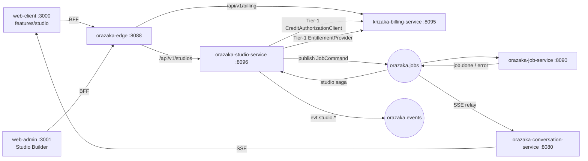
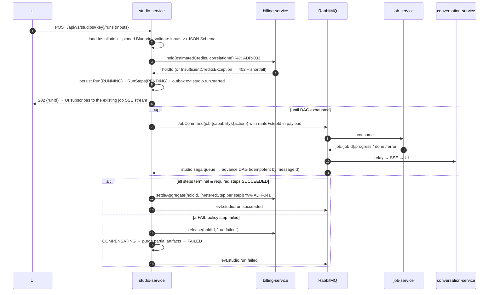

# Orazaka — Studios: installable business workflows

> **What this adds.** A new first-class menu item where a user *browses* a catalogue of ready-made,
> profession-specific AI workflows ("a real-estate agency drops 5 photos and a clip, gets an
> Instagram Reel"), *installs* one into their workspace, *configures* it once (brand kit, tone,
> hooks), and *runs* it forever. Free or paid.
>
> **The one-line architecture.** A Studio is **data**, not code: a versioned, declarative DAG whose
> nodes are `feature_key`s that already exist in `orazaka_capabilities`. Adding a Studio is an
> **admin action**, never a deploy — the same rule ADR-027/ADR-031 already impose on models,
> interceptors and pricing.
>
> Normative rules: [`AGENTS.md`](../AGENTS.md). Decision record:
> [`ADR-034`](adr/ADR-034-studio-marketplace.md). Depends on: ADR-027 (DB-driven config),
> ADR-032 (service decomposition), ADR-033 (credit metering).

---

## 1. Naming — and the collision we must not create

`package` is **already taken**. `billing_pack` (ADR-033, `infra/initdb/70-billing.sql`) is a
priced bundle carrying a `profession` column and an entitlement matrix; `CatalogPack`,
`PackCatalogService` and `PackController` implement its admin surface. ADR-033 §Context even
states the intent explicitly: *"a path to selling curated workflow bundles per profession."*

So the commercial half of this feature **already exists**. What is missing is the **executable**
half. Naming them the same thing would produce two subtly different notions of "package" — the exact
failure `CatalogPack`'s javadoc warns against.

**Decision: the executable half is a `Studio`.**

| Term | Owner | Means | Never means |
|:---|:---|:---|:---|
| **Studio** | `orazaka-studio-service` | An installable business workflow product: identity, marketing copy, blueprint versions, inputs, assets | A payment, a plan, a Spring bean |
| **Blueprint** | Studio context | One immutable, semver'd version of a Studio's DAG (steps, prompts, schema) | A running instance |
| **Installation** | Studio context | One actor's copy of a Studio: pinned blueprint version + their configuration | Ownership of the Studio itself |
| **Run** | Studio context | One execution of an Installation, fanned out into `orazaka_jobs` | A job |
| **Package** | `krizaka-billing-service` | The *priced* bundle that grants entitlement to one or more Studios | The workflow |
| **Capability / feature_key** | Conversation/Job context | An atomic AI operation (`orazaka.core.media.video`) | A workflow |

**Rejected alternatives**: `Playbook` (collides with `docs/BUSINESS_IMPLEMENTATION.md`, "the CinePulse
Playbook"), `Atelier` (French term in an English codebase), `Solution` (no evocative power in code or
UI), `Package` (collision above), `Module`/`Plugin` (implies deployed code — the opposite of what
this is).

**Product naming for the launch Studios** — name the *outcome*, never the mechanism. Not "visual
generation": `realestate-reels` → *"Reels Immobilier"*; `trade-showcase` → *"Vitrine Artisan"*;
`outbound-prospection` → *"Prospection Outbound"*. The UI section is **Studios**, split
`Mes Studios` / `Explorer`.

> **If you ever want to rename `Studio`**, it is a mechanical change confined to: the
> `com.krizaka.orazaka.studio*` packs, `infra/initdb/80-studio.sql`, `/api/v1/studios`, the
> `features/studio/` UI folder and the `studio.*` entitlement-key prefix. Nothing else references it.

---

## 2. The load-bearing insight

Orazaka already owns every primitive this feature needs. The Studio context adds **composition**,
not capability.

| Need | Already exists | Studio adds |
|:---|:---|:---|
| Execute an AI step | `orazaka_capabilities.handler_key` → `JobExecutionStrategy` in `orazaka-job-service` | Nothing. A blueprint step *is* a `feature_key`. |
| Async execution + progress | `orazaka.jobs` exchange, `JobCommand`, `job.{jobId}.progress\|done\|error`, `JobEventListener` → SSE | A saga that advances the DAG on `job.done` |
| Authorise before spending | ADR-033 `hold` → `settle` → `release`, `CreditAuthorizationClient` | One hold per *run*, not per step |
| Gate access | `EntitlementSnapshot.allows("capability.video")` | Key convention `studio.<studioKey>=true` |
| Sell it | `billing_pack` + `billing_pack_entitlement` | A nullable `pack_key` on the Studio row |
| Per-user secrets | `connector_credentials` (automation ctx) | Reused verbatim for publish-to-Instagram steps |
| Enrich a prompt | `PromptContextInterceptor` pipeline, `governance/` predicates | A brand-kit enrichment interceptor |
| Human approval | `PlanApprovalCard.tsx`, `IntentEnvelope` | An `approval: true` step type |
| RAG grounding | `orazaka-knowledge-service`, `orazaka_tools_rag_source` | A `knowledge` step type |

**Consequence.** No new execution engine, no new worker, no new transport. The Studio service is a
*catalogue + saga + configuration* service. That is why this is a 6-phase increment and not a rewrite.

---

## 3. Bounded context & placement

A new **Tier-3 owned domain** service, per AGENTS.md §2 and the ADR-032 phasing.

```
orazaka-apps/services/orazaka-studio/orazaka-studio-api/     ← Tier-1: interfaces + DTOs, zero impl deps
orazaka-apps/services/orazaka-studio/orazaka-studio-client/            ← Tier-2 SDK: HTTP/NoOp adapters for the Tier-1 ports
orazaka-apps/services/orazaka-studio/orazaka-studio-service/  ← :8096, owns orazaka_studio_db AND the DAG interpreter
orazaka-libs/orazaka-ai-engine/orazaka-business/                 ← + usecases/studio/StudioRunUseCase (port-only)
```

**Why a service and not a pack in `conversation-service`.** Three independent reasons, any one of
which suffices: (a) it owns durable state with its own lifecycle (installations, runs) — Tier-3 rule
says one owner, one schema; (b) its write pattern (long-lived sagas, hours) is nothing like the
conversation service's (interactive, sub-second) and would pollute its connection pool and
virtual-thread budget; (c) a marketplace is the natural seam for third-party publishers later, and
retrofitting a boundary is strictly harder than drawing it now.

**Where the DAG interpreter lives — corrected during implementation.** It is in the **service**, not
in `orazaka-business`.

The original reasoning (*layer ≠ process*; workflow orchestration is `business`'s responsibility) is
sound but unbuildable here: SEAM-002 lists `com.krizaka.orazaka.business..` as a foreign Tier-3
implementation, and §15 below requires `StudioServiceGovernanceTest` to enforce SEAM-002 — the
service cannot both host `business` and pass its own governance test. AGENTS.md wins. Hosting
`business` here would also give that library a second owner, which is the distributed monolith
AGENTS.md §2 names as the primary health gauge.

*Layer ≠ process* is still honoured: the interpreter sits behind two ports
(`BlueprintRepository`, `StepExecutionClient`) and can be re-hosted without moving code. And a Studio
run is still a first-class `Intention` — `StudioRunUseCase` lives in `orazaka-business` and depends
on the **Tier-1 `StudioRunClient` port**, whose HTTP adapter is `orazaka-studio-client`. That is the
same arrangement `krizaka-billing-client` already uses for `CreditAuthorizationClient`.

**Ports** (existing: 8080 conversation · 8082 automation · 8083 identity · 8084 knowledge ·
8088/8089 edge · 8090 job · 8095 billing). Studio takes **`STUDIO_PORT:8096`**.

### Context map



**Invariant.** The Studio service **never** calls the job service over HTTP and **never** reads
another context's tables. It publishes `JobCommand`s and consumes job events — the exchanges *are*
the API (ADR-032).

---

## 4. Domain model

All records are self-validating in their compact constructor (ERR-106/116). One top-level type per
file, one mirroring test file (ERR-103).

### 4.1 `Studio` — the marketplace item

```java
public record Studio(
    String studioKey,          // stable, kebab-case: "realestate-reels"
    String label,              // "Reels Immobilier"
    String tagline,            // one selling line
    String profession,         // "real-estate" | "trades" | "sales" | ...
    String iconKey,            // resolves in the design-system Icon registry
    String heroAssetId,        // opaque asset id for the catalogue card
    StudioPricing pricing,     // FREE | INCLUDED | PAID
    String packKey,         // OPAQUE ref into billing; null when FREE
    String entitlementKey,     // "studio.realestate-reels" — the gate
    StudioStatus status,       // DRAFT | IN_REVIEW | PUBLISHED | DEPRECATED | WITHDRAWN
    String publisherId,        // "orazaka" today; a tenant id when the marketplace opens
    String latestVersion,      // semver of the newest PUBLISHED blueprint
    Set<String> locales,       // labels/taglines are i18n rows, see §5
    Instant updatedAt) {}
```

### 4.2 `Blueprint` — one immutable version

```java
public record Blueprint(
    String studioKey,
    String version,                 // semver; immutable once PUBLISHED
    BlueprintStatus status,
    String inputSchema,             // JSON Schema (draft 2020-12) for the run form
    List<BlueprintStep> steps,      // the DAG, topologically valid
    List<BlueprintOutput> outputs,  // what the user gets back
    Map<String, String> configSchemaDefaults, // brand kit, tone, hashtags…
    long estimatedCredits,          // pre-run estimate; the hold amount
    String changelog,
    Instant publishedAt) {}
```

`Blueprint` validates in its constructor that: the step graph is **acyclic**, every `dependsOn`
resolves, every `{{ … }}` placeholder resolves against `inputSchema` ∪ upstream `out` names, and
`steps` is non-empty. A blueprint that cannot be statically validated is never persisted — this is
the anti-corruption boundary (ERR-127), and it is why the run path needs no defensive checks.

### 4.3 `BlueprintStep` — the unit of composition

```java
public record BlueprintStep(
    String id,                      // unique within the blueprint
    StepKind kind,                  // CAPABILITY | KNOWLEDGE | CONNECTOR | APPROVAL | TRANSFORM
    String featureKey,              // OPAQUE ref into orazaka_capabilities; required for CAPABILITY
    Set<String> dependsOn,
    Map<String, String> inputs,     // templated: {{inputs.photos}}, {{steps.brief.text}}
    String out,                     // scope name for downstream steps
    String forEach,                 // fan-out source, e.g. "{{inputs.photos}}"; null = single shot
    int maxParallel,                // fan-out concurrency cap; MLX/GPU-aware
    ErrorPolicy onError,            // FAIL | SKIP | RETRY
    int maxAttempts,
    Duration timeout,
    String condition) {}            // "{{inputs.withVideo}} == true"; null = always
```

### 4.4 `Installation` — one actor's copy

```java
public record Installation(
    UUID id,
    String actorId,                 // OPAQUE — no FK into identity
    String studioKey,
    String pinnedVersion,           // upgrades are explicit, never silent
    InstallationStatus status,      // ACTIVE | PAUSED | UPGRADE_AVAILABLE | REVOKED
    Map<String, String> config,     // validated against the blueprint's config schema
    Instant installedAt,
    Instant lastRunAt) {}
```

### 4.5 `Run` — one execution

```java
public record Run(
    UUID id,
    UUID installationId,
    String actorId,
    String studioKey,
    String blueprintVersion,        // denormalised: a run is reproducible after an upgrade
    RunStatus status,               // PENDING_APPROVAL | RUNNING | AWAITING_INPUT | SUCCEEDED | FAILED | CANCELLED | COMPENSATING
    String holdId,                  // ADR-033 credit hold covering the whole run
    String correlationId,
    Map<String, Object> inputs,
    Instant startedAt,
    Instant finishedAt) {}
```

`RunStep` carries `(runId, stepId, ordinal, jobId, status, output, attempts, error)` — `ordinal`
distinguishes fan-out instances. Its `status` is a **`RunStepStatus`**, deliberately not `RunStatus`:
a step is never `PENDING_APPROVAL`, `AWAITING_INPUT` or `COMPENSATING` (those describe the run) and a
run is never `SKIPPED` (that is what `ErrorPolicy.SKIP` does to a step). Sharing one enum would make
half of each vocabulary unrepresentable-but-legal.

```java
public enum RunStepStatus { PENDING, RUNNING, SUCCEEDED, FAILED, SKIPPED, CANCELLED }
```

### 4.6 Invariants

1. A `Blueprint` in `PUBLISHED` is **immutable**. Editing means minting a new version.
2. An `Installation` pins a version. A new version sets `UPGRADE_AVAILABLE`; it never migrates
   silently — a changed prompt is a changed product.
3. A `Run` denormalises `blueprintVersion`. Deleting a version is forbidden while runs reference it
   (`DEPRECATED` is the terminal state, not `DELETE`).
4. **No cross-context foreign key.** `actorId`, `packKey`, `featureKey`, `assetId` are opaque
   strings. Enforced on every build by `SqlBoundaryRules` [SEAM-001].
5. Entitlement gates **access**; credits gate **volume** (ADR-033). A run is refused for two
   distinguishable reasons and the UI must say which.

---

## 5. Persistence — `infra/initdb/80-studio.sql`

Own database, own role, created by its own initdb file (AGENTS.md §5). Applied alphabetically after
billing.

> **Since ADR-036 this file also holds the Pack catalogue** — `pack_category`, `pack_category_i18n`,
> `pack`, `pack_i18n` and the `pack_studio` join. A Pack is a bundle of Studios, so its catalogue
> belongs to whoever owns the Studios; `billing_pack` in `70-billing.sql` narrowed to the price tag.
> The tables below are the Studio half only. `pack_studio` is declared after `studio` because it
> references it.

```sql
-- ══ 80-studio.sql — Studio bounded context ══════════════════════════════════
CREATE ROLE orazaka_studio LOGIN PASSWORD :'studio_password';
CREATE DATABASE orazaka_studio_db OWNER orazaka_studio;
\connect orazaka_studio_db

-- ── Catalogue ───────────────────────────────────────────────────────────────
CREATE TABLE studio (
    studio_key       VARCHAR(60)  PRIMARY KEY,
    label            VARCHAR(120) NOT NULL,
    tagline          VARCHAR(255),
    profession       VARCHAR(60)  NOT NULL,
    icon_key         VARCHAR(60)  NOT NULL,
    hero_asset_id    VARCHAR(255),
    pricing          VARCHAR(20)  NOT NULL,          -- FREE | INCLUDED | PAID
    pack_key      VARCHAR(50),                    -- OPAQUE ref into billing — no FK
    entitlement_key  VARCHAR(120) NOT NULL,          -- studio.<studio_key>
    status           VARCHAR(20)  NOT NULL DEFAULT 'DRAFT',
    publisher_id     VARCHAR(255) NOT NULL DEFAULT 'orazaka',
    latest_version   VARCHAR(20),
    sort_weight      INT          NOT NULL DEFAULT 0,
    updated_at       TIMESTAMPTZ  NOT NULL DEFAULT now(),
    CONSTRAINT studio_pricing_needs_package
        CHECK (pricing <> 'PAID' OR pack_key IS NOT NULL)
);
CREATE INDEX idx_studio_browse ON studio(status, profession, sort_weight DESC);

CREATE TABLE studio_i18n (
    studio_key VARCHAR(60) NOT NULL REFERENCES studio(studio_key) ON DELETE CASCADE,
    locale     VARCHAR(10) NOT NULL,
    label      VARCHAR(120) NOT NULL,
    tagline    VARCHAR(255),
    description TEXT,
    PRIMARY KEY (studio_key, locale)
);

CREATE TABLE studio_blueprint (
    studio_key   VARCHAR(60) NOT NULL REFERENCES studio(studio_key) ON DELETE CASCADE,
    version      VARCHAR(20) NOT NULL,
    status       VARCHAR(20) NOT NULL DEFAULT 'DRAFT', -- DRAFT | PUBLISHED | DEPRECATED
    definition   JSONB       NOT NULL,                 -- steps + outputs, see §6
    input_schema JSONB       NOT NULL,                 -- JSON Schema 2020-12
    config_schema JSONB      NOT NULL DEFAULT '{}',
    estimated_credits BIGINT NOT NULL DEFAULT 0,
    changelog    TEXT,
    published_at TIMESTAMPTZ,
    created_by   VARCHAR(255) NOT NULL,
    created_at   TIMESTAMPTZ NOT NULL DEFAULT now(),
    PRIMARY KEY (studio_key, version)
);

-- A PUBLISHED blueprint is immutable: the trigger refuses any UPDATE that is not
-- a status transition, and any DELETE. Same construction as credit_ledger_entry
-- (ADR-033) — a REVOKE would not hold, the table owner keeps implicit rights.
CREATE OR REPLACE FUNCTION studio_blueprint_immutable() RETURNS TRIGGER AS $$
BEGIN
  IF TG_OP = 'DELETE' THEN
    RAISE EXCEPTION 'studio_blueprint is append-only once published';
  END IF;
  IF OLD.status = 'PUBLISHED' AND (NEW.definition IS DISTINCT FROM OLD.definition
        OR NEW.input_schema IS DISTINCT FROM OLD.input_schema) THEN
    RAISE EXCEPTION 'published blueprint % %: mint a new version', OLD.studio_key, OLD.version;
  END IF;
  RETURN NEW;
END $$ LANGUAGE plpgsql;

CREATE TRIGGER trg_studio_blueprint_immutable
  BEFORE UPDATE OR DELETE ON studio_blueprint
  FOR EACH ROW EXECUTE FUNCTION studio_blueprint_immutable();

-- ── Workspace ───────────────────────────────────────────────────────────────
CREATE TABLE studio_installation (
    id             UUID PRIMARY KEY DEFAULT gen_random_uuid(),
    actor_id       VARCHAR(255) NOT NULL,             -- OPAQUE — no FK
    studio_key     VARCHAR(60)  NOT NULL REFERENCES studio(studio_key),
    pinned_version VARCHAR(20)  NOT NULL,
    status         VARCHAR(30)  NOT NULL DEFAULT 'ACTIVE',
    config         JSONB        NOT NULL DEFAULT '{}',
    installed_at   TIMESTAMPTZ  NOT NULL DEFAULT now(),
    last_run_at    TIMESTAMPTZ,
    UNIQUE (actor_id, studio_key)                     -- one installation per actor per studio
);
CREATE INDEX idx_installation_actor ON studio_installation(actor_id, status);

-- ── Execution ───────────────────────────────────────────────────────────────
CREATE TABLE studio_run (
    id               UUID PRIMARY KEY DEFAULT gen_random_uuid(),
    installation_id  UUID NOT NULL REFERENCES studio_installation(id) ON DELETE CASCADE,
    actor_id         VARCHAR(255) NOT NULL,
    studio_key       VARCHAR(60)  NOT NULL,
    blueprint_version VARCHAR(20) NOT NULL,
    status           VARCHAR(30)  NOT NULL,
    hold_id          VARCHAR(255),                    -- OPAQUE ref into billing
    correlation_id   VARCHAR(255) NOT NULL,
    inputs           JSONB        NOT NULL DEFAULT '{}',
    outputs          JSONB,
    error_message    TEXT,
    started_at       TIMESTAMPTZ  NOT NULL DEFAULT now(),
    finished_at      TIMESTAMPTZ
);
CREATE INDEX idx_run_actor_time ON studio_run(actor_id, started_at DESC);
```

**How `outputs` reaches the client — corrected during implementation.** The column stays a bare
`key → value` object, but the run **API** returns a *list* of artefacts, each carrying the `label`
and `type` its blueprint declared (§6). Returning the raw column meant `type` was parsed, validated
and then dropped, so a `VIDEO` output arrived at the browser as an opaque asset id beside a copy
button — the player this section's own file manifest calls for could not be built.

The label and type are **joined from the blueprint at read time**, not copied into the run row: a
blueprint version is immutable (the `trg_studio_blueprint_immutable` trigger enforces it), so the
join is stable — a run read a year later renders exactly as it did the day it finished — and the
same fact is never stored twice with two chances to disagree. The join is memoised per version so a
history page stays clear of the N+1 [ERR-109] bans.

```sql
CREATE INDEX idx_run_active ON studio_run(status) WHERE finished_at IS NULL;

CREATE TABLE studio_run_step (
    run_id     UUID NOT NULL REFERENCES studio_run(id) ON DELETE CASCADE,
    step_id    VARCHAR(60) NOT NULL,
    ordinal    INT NOT NULL DEFAULT 0,                -- fan-out index
    job_id     VARCHAR(36),                           -- OPAQUE ref into orazaka_jobs — no FK
    status     VARCHAR(30) NOT NULL,
    attempts   INT NOT NULL DEFAULT 0,
    output     JSONB,
    error_message TEXT,
    started_at TIMESTAMPTZ,
    finished_at TIMESTAMPTZ,
    PRIMARY KEY (run_id, step_id, ordinal)
);
CREATE INDEX idx_run_step_job ON studio_run_step(job_id) WHERE job_id IS NOT NULL;

-- ── Plumbing (same shape as every other context) ────────────────────────────
CREATE TABLE studio_outbox (
    id UUID PRIMARY KEY DEFAULT gen_random_uuid(),
    aggregate_id VARCHAR(255) NOT NULL,
    event_type   VARCHAR(120) NOT NULL,
    payload      JSONB NOT NULL,
    created_at   TIMESTAMPTZ NOT NULL DEFAULT now(),
    next_attempt_at TIMESTAMPTZ NOT NULL DEFAULT now(),
    attempts     INT NOT NULL DEFAULT 0,
    published_at TIMESTAMPTZ
);
CREATE INDEX idx_studio_outbox_pending ON studio_outbox(next_attempt_at) WHERE published_at IS NULL;

-- Keyed (consumer, message_id) like every other context's copy. The studio service runs
-- FOUR consumers (job outcomes, connector telemetry, subscription changes, the outbox
-- relay); a single-column key would let whichever ran first silently swallow the others'
-- delivery of the same message id.
CREATE TABLE processed_messages (
    consumer     VARCHAR(100) NOT NULL,
    message_id   VARCHAR(100) NOT NULL,
    processed_at TIMESTAMPTZ DEFAULT now(),
    PRIMARY KEY (consumer, message_id)
);

CREATE TABLE studio_runtime_config (
    config_key   VARCHAR(120) PRIMARY KEY,
    config_value TEXT NOT NULL,
    value_type   VARCHAR(20) NOT NULL,
    description  TEXT
);
INSERT INTO studio_runtime_config (config_key, config_value, value_type, description) VALUES
 ('run.max-concurrent-per-actor', '2',  'int',     'Concurrent runs one actor may hold.'),
 ('run.step-timeout-seconds',     '900','int',     'Default per-step ceiling before the saga fails the step.'),
 ('run.fan-out-max',              '10', 'int',     'Hard cap on forEach expansion — protects the MLX budget.'),
 ('marketplace.third-party-enabled','false','boolean','Opens publishing to non-orazaka publishers.')
ON CONFLICT (config_key) DO NOTHING;
```

**Seeds** (dev): the two launch Studios of §11, each `PUBLISHED` at `1.0.0`, `pricing = FREE` for
`trade-showcase` and `PAID`/`pack_key = 'realestate-studio'` for `realestate-reels`, plus the
`realestate-studio` **catalogue** row (`pack` + `pack_i18n` + `pack_studio`) here and the matching
`billing_pack` **price** row in `70-billing.sql` with its `billing_pack_entitlement`
`studio.realestate-reels = true`. Each context seeds **only its own database** — and
`PackCoherenceRules` [PACK-001] fails the build if those two halves ever stop agreeing, because the
result is an actor who pays for the pack and stays locked out of the Studio (ADR-036).

---

## 6. The Blueprint DSL

The whole product surface is this JSON. It is stored in `studio_blueprint.definition`, authored in
the admin console, validated at publish time, and interpreted at run time.

```jsonc
{
  "studioKey": "realestate-reels",
  "version": "1.0.0",
  "inputs": {                                   // JSON Schema 2020-12 → renders the run form
    "type": "object",
    "required": ["photos", "propertyBrief"],
    "properties": {
      "photos":        { "type": "array", "items": { "$ref": "#/$defs/asset" },
                         "minItems": 3, "maxItems": 8, "title": "Photos du bien" },
      "clip":          { "$ref": "#/$defs/asset", "title": "Clip vidéo (optionnel)" },
      "propertyBrief": { "type": "string", "maxLength": 800, "title": "Le bien en 3 lignes" },
      "platform":      { "enum": ["instagram-reel", "tiktok", "youtube-short"],
                         "default": "instagram-reel" }
    }
  },
  "config": {                                   // asked ONCE at install, not per run
    "brandName":    { "type": "string" },
    "brandColors":  { "type": "array", "items": { "type": "string", "pattern": "^#" } },
    "logoAssetId":  { "type": "string" },
    "tone":         { "enum": ["premium", "chaleureux", "direct"], "default": "premium" },
    "signature":    { "type": "string" }
  },
  "steps": [
    { "id": "describe", "kind": "CAPABILITY",
      "featureKey": "orazaka.core.media.vision",
      "forEach": "{{inputs.photos}}", "maxParallel": 4,
      "inputs": { "assetId": "{{item}}",
                  "prompt": "Décris cette pièce pour une annonce immobilière. Style: {{config.tone}}." },
      "out": "roomDescriptions", "onError": "SKIP", "timeout": "PT2M" },

    { "id": "script", "kind": "CAPABILITY", "dependsOn": ["describe"],
      "featureKey": "orazaka.core.chat.completion",
      "inputs": { "promptRef": "studio/realestate-reels/script.md",
                  "brief": "{{inputs.propertyBrief}}",
                  "rooms": "{{steps.roomDescriptions}}",
                  "platform": "{{inputs.platform}}" },
      "out": "script", "onError": "RETRY", "maxAttempts": 2 },

    { "id": "approve", "kind": "APPROVAL", "dependsOn": ["script"],
      "inputs": { "preview": "{{steps.script.text}}" } },

    { "id": "voice", "kind": "CAPABILITY", "dependsOn": ["approve"],
      "featureKey": "orazaka.core.media.speech",
      "inputs": { "text": "{{steps.script.voiceover}}", "voice": "{{config.voice:alloy}}" },
      "out": "voiceover" },

    { "id": "b-roll", "kind": "CAPABILITY", "dependsOn": ["approve"],
      "condition": "{{inputs.clip}} == null",
      "featureKey": "orazaka.core.media.video",
      "inputs": { "prompt": "{{steps.script.bRollPrompt}}", "durationSeconds": 5 },
      "out": "bRoll" },

    { "id": "assemble", "kind": "CAPABILITY", "dependsOn": ["voice", "b-roll"],
      "featureKey": "orazaka.studio.media.compose",
      "inputs": { "photos": "{{inputs.photos}}", "clip": "{{inputs.clip}}",
                  "bRoll": "{{steps.bRoll.assetId}}", "audio": "{{steps.voiceover.assetId}}",
                  "captions": "{{steps.script.captions}}", "brandKit": "{{config}}",
                  "aspect": "9:16" },
      "out": "reel" },

    { "id": "publish", "kind": "CONNECTOR", "dependsOn": ["assemble"],
      "connectorType": "INSTAGRAM", "condition": "{{config.autoPublish:false}} == true",
      "inputs": { "media": "{{steps.reel.assetId}}", "caption": "{{steps.script.caption}}" },
      "onError": "SKIP" }
  ],
  "outputs": [
    { "key": "reel",     "label": "Votre Reel",      "from": "{{steps.reel.assetId}}",    "type": "VIDEO" },
    { "key": "caption",  "label": "Légende",         "from": "{{steps.script.caption}}",  "type": "TEXT" },
    { "key": "hashtags", "label": "Hashtags",        "from": "{{steps.script.hashtags}}", "type": "TEXT" }
  ]
}
```

### 6.1 Step kinds

| Kind | Executes via | Notes |
|:---|:---|:---|
| `CAPABILITY` | `JobCommand` → `orazaka.jobs` → existing `JobExecutionStrategy` | The default. `featureKey` must exist and be enabled. |
| `KNOWLEDGE` | `orazaka-knowledge-service` retrieve | Grounds a step in the actor's RAG sources. **Not executable yet**: no knowledge capability is registered, and a published blueprint may only name capabilities that exist and are enabled (§15). Parsed, validated, skipped. |
| `CONNECTOR` | `job.automation.approved` → `ConnectorDispatcher`, answering on `evt.automation.telemetry` | Reuses `connector_credentials`. The step names a `connectorType`; the Studio service never sees a secret. |
| `APPROVAL` | No execution — parks the run at `AWAITING_INPUT` | Renders `PlanApprovalCard` |
| `TRANSFORM` | In-process, pure | Only declarative reshaping (pick/join/format). **No expression evaluation, no scripting.** |

### 6.2 Templating — deliberately not Turing-complete

`{{ … }}` resolves against a typed `RunScope` record holding `inputs`, `config`, `steps`, `item`
(inside a `forEach`) and `secrets` (never rendered into logs). The scope **resolves its own
placeholders** — a smart payload, not a `TemplateUtil` (ERR-127). Supported forms and nothing else:

- `{{inputs.x}}`, `{{config.x}}`, `{{steps.<out>.<field>}}`, `{{item}}`, `{{secrets.x}}`
- the **bare** forms `{{config}}` and `{{steps.<out>}}` — the example above uses both
  (`"brandKit": "{{config}}"`, `"rooms": "{{steps.roomDescriptions}}"`), so they are part of the
  grammar, not an oversight
- default fallback `{{config.voice:alloy}}` (the same `${key:default}` grammar as
  `orazaka_capabilities.payload_template` — one templating grammar in the platform, not two)
- conditions: `<ref> == <literal>`, `<ref> != <literal>`, `<ref> is null`, `<ref> is not null`

**Step ids are kebab-case** (`^[a-z][a-z0-9-]{0,59}$`): a step id is addressed from `dependsOn`, from
`studio_run_step.step_id` and from the authoring UI, so it carries no case, whitespace or punctuation.

**Rendering a composite.** A bare `{{steps.<out>}}` on a fan-out step resolves to a *list*, and a
step output is a *map* of the executor's return fields. Both render as text, not through
`toString`: a list becomes its elements one per line, a single-entry map becomes that entry's value.
Putting `[{content=…}, {content=…}]` into a model's prompt is Java syntax leaking into an inference
call. A map with several entries has no obvious reading, so the author picks one with
`{{steps.<out>.<field>}}`.

Anything richer is a **new step kind**, not a new expression. A user-authored blueprint is untrusted
input; a scripting engine there is a sandbox-escape surface that no amount of review makes safe.

### 6.3 Prompt storage

Long prompts live in markdown under `orazaka-libs/orazaka-ai-engine/orazaka-business/src/main/resources/prompts/studio/`
and are referenced by `promptRef` — the mechanism `MarkdownPromptResolver` already implements. The
blueprint JSON stays reviewable; prompts stay diffable.

---

## 7. Execution — the run saga



### 7.1 Rules that keep this correct

- **One hold per run, not per step.** A user must not discover mid-run that they can afford steps 1–4
  and not step 5. The hold covers `estimatedCredits`; it guarantees affordability up front and, at
  the run's terminal transition, becomes the debit — settled once against the sum of what the steps
  measured, each priced at its own capability's rate. A run that measured nothing is released.

> **Corrected 2026-08-31, then fixed the same day.** This bullet previously read "`settleMeasured`
> debits the sum of the steps' actual `ConsumptionReport`s", which nothing implemented — and the
> behaviour it was corrected to was itself the defect: every step carried the run's hold, so the
> **first** step to reach a terminal outcome settled the whole run against the hold's own capability
> (`AGENT`, unit `CALL`, and `quantityFor(CALL)` is a hardcoded `1`), and every later step found it
> closed. **A `realestate-reels` run reserved 480 credits and was debited 5.**
>
> [ADR-041](adr/ADR-041-run-settlement.md) closed it. `StepDispatch.holdId` is removed, so a step
> cannot settle the run by accident; each step's measurements are stored on its `studio_run_step`
> row in the same statement that marks it terminal; and the saga settles **once** at the run's
> terminal transition through `settleAggregate`, which prices every step against **its own**
> capability's rate inside the billing service, at the pricebook version the hold pinned. One hold,
> one debit, one `usage_event` per step so the total stays reconstructible.
>
> **Measured:** the same run now reserves 480 and is debited **480** — `b-roll` 450, `assemble` 30.
> Two of its four metered steps still contribute 0 because their executors report no priceable
> measurement, which is a reporting gap rather than a settlement one and is now visible as a warning
> per step; see [§6.1](PACK_EXTENSIBILITY_ARCHITECTURE.md#61--closed--studio-runs-are-effectively-unbilled).
- **Idempotency twice over**, as ADR-033 argues for the ledger: `processed_messages` on `messageId`,
  plus the `(run_id, step_id, ordinal)` primary key. At-least-once delivery must not double-submit a
  video job.
- **The DAG advances in a single transactional statement** per event: `UPDATE studio_run_step SET
  status=… WHERE run_id=? AND step_id=? AND ordinal=? AND status='RUNNING'`, then re-evaluate ready
  steps. No read-before-write (ERR-109).
- **A stuck run is swept.** `RunSweeper` (`infrastructure/adapter/schedule`) fails runs whose steps
  exceeded `run.step-timeout-seconds` and **releases the hold** — the same class of omission ADR-033
  calls out for `credit_hold`, and a build-enforced fitness function here too.
- **Fan-out is capped** by `run.fan-out-max` and `maxParallel`. On Apple Silicon the MLX budget is
  the scarce resource; an uncapped `forEach` over 40 photos is a self-inflicted outage
  (see `COMP-04`, MLX frame clamping).
- **Cancellation** sets `CANCELLED`, releases the hold, and stops submitting; in-flight jobs are
  allowed to finish and their results discarded (killing a running MLX job is not free either).
- **Reproducibility**: a run stores `blueprint_version` and its resolved inputs, so "re-run" after an
  upgrade replays the *old* version unless the user opts in.

### 7.2 One new capability is required

`orazaka.studio.media.compose` — the assembly step (photos + clip + voiceover + captions +
brand overlay → 9:16 MP4). It is **a capability, not Studio code**: it belongs in
`orazaka_capabilities` with a `handler_key` of `media.compose`, executed by the existing Python
`orazaka-worker-media` (ffmpeg/MLX). Registering it is one seed row in `30-jobs-config.sql` plus one
`JobExecutionStrategy`-equivalent branch in `orazaka-apps/workers/orazaka-worker-media/app/`. Every
other launch step reuses a capability that exists today.

---

## 8. Billing, entitlement & the install flow

### 8.1 Three pricing modes

| `pricing` | Meaning | Install path |
|:---|:---|:---|
| `FREE` | Anyone may install; runs still consume credits | Install immediately |
| `INCLUDED` | Granted by the actor's *plan* entitlements | Install if `snapshot.allows(entitlementKey)` |
| `PAID` | Requires purchasing the linked `billing_pack` | `409` + `packKey` → UI opens checkout → on `evt.billing.package.purchased`, install unlocks |

### 8.2 The entitlement key convention

`studio.<studioKey>` (e.g. `studio.realestate-reels`). Because `EntitlementSnapshot` reads
**arbitrary string keys** (ADR-033: *"a new plan or a new key is an admin action, never a deploy"*),
adding a Studio requires **zero billing code**: one `billing_pack_entitlement` row.

A plan may also grant a wildcard tier — `studio.tier.premium = true` — with the Studio row declaring
`entitlement_key = 'studio.tier.premium'`. That is how "all Studios included in Ultimate" is
expressed without enumerating them.

### 8.3 Gate placement

Entitlement is checked **twice, on purpose**:

1. **Catalogue read** (`GET /api/v1/studios`) — cosmetic. Locked Studios are *shown*, greyed, with the
   upsell. Hiding them destroys the funnel.
2. **Install** and **run submission** — authoritative, server-side, in `StudioInstallationService` /
   `StudioRunService` via `EntitlementProvider`.

`EntitlementSnapshot.resolved()` must be honoured: when billing is unreachable, a snapshot is
*unresolved*, and the Studio service **must not** refuse an actor for a Studio they pay for. Follow
the existing rule — pass unresolved through for `INCLUDED`/`FREE`, refuse only `PAID` with a
`503`-flavoured message, never a `403`.

### 8.4 Refunds & failures

A failed run is never billed (`release`). A partially-successful run where a `SKIP`-policy step
failed **is** billed for what ran — and the run detail must show exactly which steps were charged.
Every refusal writes a `credit_refusal` row (existing table) so the funnel is measurable: refusals by
Studio are the sharpest upgrade signal the product has.

---

## 9. Interceptor & core integration

The Studio context touches the pipeline in exactly **two** places. Everything else is composition.

### 9.1 `BrandContextInterceptor` — `orazaka-interceptors/…/interceptor/enrichment/`

Injects the installation's `config` (brand name, tone, colours, signature, forbidden words) into the
prompt context, so a Studio's voice is consistent across every step **without every prompt template
repeating it**. It reads `orazaka.studio.installationId` from `Context.preferences()` — the same
`orazaka.*` preference namespace `WorkflowAdapter` already uses. Absent that key, it is a no-op:
chat is unaffected.

- `isAiDependent()` → `false` (pure enrichment; survives the `disable-ai` kill-switch).
- Ordered in `pipeline_interceptor_config` after context, before reformulation.
- Activation predicate in `interceptor_policy` (§60-governance): `preference.exists:orazaka.studio.installationId`.

### 9.2 `STUDIO` capability — `orazaka-business`

```java
public enum Capability { CHAT, IMAGE, AUDIO, VIDEO, AGENT, ADMIN, STUDIO }

public sealed interface Payload extends UseCasePayload
    permits ChatPayload, ImagePayload, AgentPayload, StudioPayload {}
```

`StudioRunUseCase implements UseCase<StudioPayload, RunAccepted>` with descriptor
`("studio.run", Capability.STUDIO, PlanningMode.DETERMINISTIC, …)`. `SpringUseCaseRegistry` resolves
it by capability, so a Studio run is a first-class `Intention` — reachable from `IntentController`,
the CLI and the agent loop, not only from the Studio REST surface. **This is the point of the
`Intention` abstraction; not using it here would be the mistake.**

The DAG interpreter lives in **`orazaka-studio-service`** (see §3 for why) and depends on two
outbound ports it declares itself, implemented as package-private `*Adapter`s beside it:

```java
public interface BlueprintRepository { Optional<Blueprint> find(String studioKey, String version); }
public interface StepExecutionClient { String submit(StepDispatch dispatch); }   // returns jobId
```

`StudioRunUseCase` in `orazaka-business` depends on neither. It depends on the **Tier-1**
`StudioRunClient`, satisfied by `orazaka-studio-client` — so `business` stays thin coordination,
hosts **no** LLM logic, and never imports another context's Tier-3 (AGENTS.md §2, SEAM-002).

---

## 10. API surface

Human-facing under `/api/v1/studios` (routed at the edge). Machine-facing under `/internal/v1` and
**deliberately not routed** — the same construction that keeps billing's hold/settle unreachable from
a browser.

| Method | Path | Auth | Purpose |
|:---|:---|:---|:---|
| `GET` | `/api/v1/studios` | user | Catalogue. `?profession=&locale=` — returns `locked` + `lockedReason` + `packKey` |
| `GET` | `/api/v1/studios/{key}` | user | Detail: description, sample outputs, input schema, estimated credits |
| `GET` | `/api/v1/studios/{key}/versions` | user | Version history + changelog |
| `POST` | `/api/v1/studios/{key}/installations` | user | Install. `201` · `409 {packKey}` when unentitled |
| `GET` | `/api/v1/studios/installations` | user | *Mes Studios* |
| `PATCH` | `/api/v1/studios/installations/{id}` | user | Update `config` (validated vs config schema) |
| `POST` | `/api/v1/studios/installations/{id}/upgrade` | user | Move the pin to `latestVersion` |
| `DELETE` | `/api/v1/studios/installations/{id}` | user | Uninstall (soft → `REVOKED`, purge on retention job) |
| `POST` | `/api/v1/studios/installations/{id}/runs` | user | Start a run. `202 {runId}` · `402` insufficient credits |
| `GET` | `/api/v1/studios/runs` | user | Run history, filterable |
| `GET` | `/api/v1/studios/runs/{id}` | user | Run detail: per-step status, outputs, credits charged |
| `POST` | `/api/v1/studios/runs/{id}/approve` | user | Resolve an `APPROVAL` step |
| `POST` | `/api/v1/studios/runs/{id}/cancel` | user | Cancel + release hold |
| `GET`/`PUT`/`DELETE` | `/api/v1/studios/admin/**` | `ROLE_ADMIN` | Authoring: draft, validate, publish, deprecate |
| `POST` | `/internal/v1/studios/runs/{id}/steps/{stepId}/callback` | M2M | Reserved for connector callbacks |

**Controllers**, resource-oriented (ERR-128), one per resource:
`StudioController`, `StudioInstallationController`, `StudioRunController`, `StudioBlueprintController`.
No `Admin*` class — admin access is `@PreAuthorize`, not a name.

**Edge route** — append to `orazaka-apps/services/orazaka-edge/src/main/resources/application.yml`:

```yaml
      - path-prefix: /api/v1/studios
        target: ${STUDIO_INTERNAL_URL:http://localhost:8096}
```

Rollback is deleting the entry (requests fall back to the `/` catch-all) — the ADR-032 mechanism.

---

## 11. The two launch Studios

Both are **data**. Neither adds a Java class beyond the one new `media.compose` capability.

### 11.1 `realestate-reels` — *"Reels Immobilier"* (PAID)

Inputs: 3–8 photos, optional clip, a 3-line brief, target platform.
Steps: vision fan-out → script (hook / voiceover / captions / caption / hashtags) → **approval** →
TTS + optional generated b-roll → compose 9:16 → optional publish.
Outputs: MP4, caption, hashtags. Estimated ≈ the sum of 5×vision + 1×chat + 1×speech + 1×video +
1×compose from the pricebook.

Generalises verbatim to plumbers, electricians and every trade by swapping `profession`, the prompt
markdown and the input labels — which is `trade-showcase`, the free variant, and the reason this
scales without engineering.

### 11.2 `outbound-prospection` — *"Prospection Outbound"* (INCLUDED)

Inputs: ICP description, target list, offer, tone.

> **Correction (2026-09-01). The original read `target list (CSV asset)`, and the parenthesis was
> removed without a record.** Commit `7b182e2c` narrowed it to a typed array of up to 50 strings —
> the same commit that recorded the `KNOWLEDGE` divergence below. One removal was amended visibly,
> the other was not, which is the failure mode this whole document's amendment discipline exists to
> prevent: the design and the shipped pack disagreed and nothing said so.
>
> **What ships is the typed list, and it stays.** A CSV asset would need the step to consume an
> uploaded file, and the input contract would become "a file whose columns we hope are the ones the
> prompt expects" — a shape with no schema, which is the opposite of an `input_schema` the run form
> is generated from. The 50-item cap is the honest limit of a form-entered list, and lifting it is
> what a CSV would really be for; that is a product decision, priced per prospect, and not a
> parenthesis to restore quietly.
Steps as shipped: chat fan-out over the list producing a per-prospect angle → `TRANSFORM` (assemble
the sequence, declaratively) → **approval** → `CONNECTOR` (CRM, reusing `connector_credentials`,
conditional on `config.autoPush`).
Outputs: the sequence and the per-prospect angles.

It exercises the step kinds the media Studios do not — `TRANSFORM`, `CONNECTOR`, large fan-out — and
the `INCLUDED` pricing mode neither other launch Studio uses, which is why it is a launch Studio
rather than a third media one.

> **The `KNOWLEDGE` step of the original design is not shipped, and phase E sharpened why.** The
> step kind exists and the interpreter has a branch for it — which SKIPS. Three things are missing,
> none of them data: a capability row, a `JobExecutor` bound to its handler key calling the
> knowledge service's `/internal/v1/knowledge/retrieve`, and the interpreter dispatching it instead
> of skipping. It is therefore NOT "a one-row decision", as this note previously said.
>
> **But the pack does not need it.** `RagInterceptor` is active in the job service and prepends
> retrieved context to every chat inference, so grounding already happens on every `CAPABILITY`
> step here — implicitly, with no step and no capability. What `KNOWLEDGE` adds is *addressable*
> retrieval, whose output a later step names. No blueprint in this pack wants that (ADR-043).

---

## 12. Frontend

### 12.1 Navigation

`orazaka-apps/ui/orazaka-web-client/src/components/layout/Sidebar.tsx` — insert between chat and jobs:

```ts
{ href: "/studios", icon: "studio", label: t.sidebar.studios },
```

Add `studio` to the centralised Lucide registry (`orazaka-design-system/src/icon.tsx`; suggested
glyph: `LayoutGrid` or `Clapperboard`) and `sidebar.studios` to
`core/context/translations.ts` (+ `translations.types.ts`) for every supported locale. No inline
icon imports, no hardcoded label.

### 12.2 Routes & files

```
src/app/(protected)/studios/page.tsx                 # Mes Studios + Explorer tabs
src/app/(protected)/studios/[studioKey]/page.tsx     # detail + install CTA
src/app/(protected)/studios/runs/[runId]/page.tsx    # live run + outputs
src/features/studio/components/StudioCatalogue.tsx   # grid + profession filter
src/features/studio/components/StudioCard.tsx        # locked state + upsell badge
src/features/studio/components/StudioDetail.tsx
src/features/studio/components/InstallDialog.tsx     # config form from config schema
src/features/studio/components/RunForm.tsx           # form generated from JSON Schema
src/features/studio/components/RunTimeline.tsx       # per-step live status
src/features/studio/components/RunOutputs.tsx        # video player, copy-to-clipboard
src/features/studio/components/StudioAsyncState.tsx  # the shared loading / load-error states
src/features/studio/hooks/usePricingLabel.ts         # one pricing wording for card + detail
src/features/studio/components/StudioUpgradeBanner.tsx
src/features/studio/hooks/useStudios.ts
src/features/studio/hooks/useInstallations.ts
src/features/studio/hooks/useStudioRun.ts            # wraps the EXISTING useJobSSE
src/services/studio.api.ts
```

### 12.3 Constraints (AGENTS.md §8, non-negotiable)

- **BFF only** — the browser hits Next.js API routes; the existing `src/app/api/v1/[...path]/route.ts`
  catch-all already proxies to the edge, so **no new BFF route is needed**.
- Types in `orazaka-apps/ui/orazaka-ui-kit/orazaka-shared/src/schemas/studio.ts` (Zod), exported from `index.ts`.
  Zero interface duplication, zero cross-import between client packs.
- ≤ 250 lines per `.tsx`; no inline hex, no hardcoded Tailwind colours — tokens only.
- Dates via `date-fns` (ERR-108). Input blocked while `isSending || isGenerating` (ERR-126).
- Run progress reuses `JobStreamContext` / `useJobSSE`. **Do not build a second SSE channel.**

### 12.4 Admin — the Studio Builder (`orazaka-web-admin` :3001)

`src/features/studio/` with a three-pane authoring view: step list (drag to reorder) · step inspector
(feature-key picker sourced from `GET /api/v1/features/all`, templated inputs with live placeholder
validation) · JSON preview. Publish is a modal that runs server-side validation and shows the
computed credit estimate before minting the version. Duplicating web-client components here is
banned — shared pieces go to `orazaka-design-system`.

---

## 13. Events (`orazaka.events`, topic)

| Routing key | Emitted when | Consumers |
|:---|:---|:---|
| `evt.studio.installed` | An installation is created | automation (onboarding email), analytics |
| `evt.studio.uninstalled` | Soft-revoked | retention job |
| `evt.studio.run.started` | Hold acquired, run persisted | analytics |
| `evt.studio.run.succeeded` | All required steps terminal-green | automation (notify), analytics |
| `evt.studio.run.failed` | Compensation complete | automation, support triage |
| `evt.studio.published` | A blueprint version reaches `PUBLISHED` | web clients (cache bust), analytics |

All published through `studio_outbox` + `OutboxRelay` — transactional outbox, never a direct publish
inside a transaction. DLQ `<queue>.dlq`, exponential retry, dedup by `messageId`. The Studio service's
own saga queue binds `job.*.done` / `job.*.error` on `orazaka.jobs`.

---

## 14. SaaS lifecycle coverage

| Concern | Where it is handled |
|:---|:---|
| Discovery / SEO | Public `GET /api/v1/studios` + a marketing route on the Krizaka site fed by the same data |
| Trial / preview | A `PREVIEW` run mode: sample inputs, watermarked output, `hold` of 0, capped at N/actor via `studio_runtime_config` |
| Purchase | Existing `billing_pack` + PSP path (ADR-033 phase 4); local phase = admin grant |
| Onboarding | `InstallDialog` collects the config once; `evt.studio.installed` triggers the welcome mail |
| Upgrade / downgrade | Pin + `UPGRADE_AVAILABLE` banner + explicit `POST /upgrade`; downgrade = pin an older `PUBLISHED` version |
| Usage limits | Entitlement `studio.runs.monthly` read via `EntitlementSnapshot.limit(…, default)` |
| Dunning / expiry | `evt.billing.subscription.changed` → `SubscriptionChangeListener` flips installations to `PAUSED`, never deletes |
| Support / debugging | Run detail exposes per-step `jobId`; admin can open the job in the existing jobs dashboard |
| Analytics | Runs by Studio, success rate, credits/run, time-to-first-run, refusals by Studio |
| Churn signal | `credit_refusal` rows keyed by Studio; `UPGRADE_AVAILABLE` never actioned |
| GDPR / Loi 25 | Uninstall soft-revokes; a retention job purges `studio_run`, `studio_run_step` and generated assets after the configured window. Export = the run history endpoint |
| Multi-tenant | Every query is scoped by `actor_id`; a workspace/org is a *future* actor kind — the opaque `actorId` already permits it with no schema change |
| Third-party publishers | `publisher_id` + `marketplace.third-party-enabled` flag; the review workflow (`DRAFT → IN_REVIEW → PUBLISHED`) is already in the status enum |
| Localisation | `studio_i18n`; UI falls back to the base row |
| Accessibility | Design-system components only; the generated run form must be keyboard-navigable and labelled |

---

## 15. Testing

Per AGENTS.md §9 — pyramid, hermetic, no staging.

**Unit** (`orazaka-studio-service`, `orazaka-business`)
- `BlueprintTest`: cycle detection, dangling `dependsOn`, unresolvable placeholder, empty steps.
- `RunScopeTest`: every supported template form + every rejected one (scripting attempts).
- `StudioTest`: `PAID` without `packKey` throws.
- One mirroring test file per top-level type (ERR-103).

**Architecture** — `StudioServiceGovernanceTest` reusing the shared `GovernanceRules`
(`orazaka-libs/orazaka-build/orazaka-test-support/…/architecture/`): package/kind rules [ERR-130], service naming
[ERR-129], controller naming [ERR-128], no `Orazaka` prefix [ERR-104], Tier-3 isolation [SEAM-002].
`SqlBoundaryRules` must see `80-studio.sql` — **no cross-context FK** [SEAM-001].

**Integration** (Testcontainers, `AbstractContainerIntegrationTest`)
- Install → run → job events → settle, with a stubbed `CreditAuthorizationClient`.
- Idempotency: replay the same `job.done` twice, assert one step transition and one settle.
- Sweeper: expire a step, assert `FAILED` **and** `release` called.
- Immutability trigger: `UPDATE` a `PUBLISHED` blueprint's `definition` → exception.

**E2E** (`orazaka-end2end`) — the quality gate. One scenario: authenticate → browse → install a FREE
Studio → run with fixture assets → assert `SUCCEEDED` and an output asset exists → assert the wallet
moved by the settled amount.

**Fitness functions**, in the ADR-033 spirit (a sweeper is not a TODO) — all three now run on every
build:
1. A stalled run is failed **and its hold released** — `StudioRunLifecycleIT`, against the real
   `80-studio.sql`. This is the one the ADR says will hurt if skipped.
2. A `PUBLISHED` blueprint whose `featureKey`s are not all present and enabled in
   `orazaka_capabilities` fails the build — `BlueprintSeedFitnessTest`.
   *This deliberately does **not** run at publish time:* `orazaka_capabilities` belongs to another
   context's database, and reading it from the studio service is the coupling SEAM-001/002 forbid. A
   build-time check over the seed files catches the same mistake without creating a runtime
   dependency, which is why §15 framing it as a fitness function was right.
3. Every `Studio` row's `entitlement_key` is granted by at least one plan or package (no unreachable
   Studio) — `BlueprintSeedFitnessTest`. `EntitlementSnapshot.allows` reads an absent key as a
   denial, so an ungranted key makes a Studio invisible to every actor.

---

## 16. Rollout

Six phases, each independently shippable and each ending green (build + `GovernanceTest`), so each is
a valid recovery checkpoint. Commit `refactor(phase-N): …` locally, never push (AGENTS.md §13).

| Phase | Scope | Done when |
|:---|:---|:---|
| **0** | Contract + schema. `orazaka-studio-api`, `80-studio.sql`, `Capability.STUDIO`, `StudioPayload`, pom module, `.env`/`exemple.env.txt` keys | `orazaka start` boots with the new DB; `SqlBoundaryRules` green |
| **1** | Catalogue read-only. Service skeleton :8096, `StudioController`, edge route, seeds, UI `/studios` grid + detail (no install) | A user can browse two seeded Studios; locked state renders |
| **2** | Install + config. `StudioInstallationController`, `EntitlementProvider` gate, `InstallDialog`, *Mes Studios* | Install → configure → uninstall round-trips; `PAID` returns `409 {packKey}` |
| **3** | Blueprint engine + run. `orazaka-business/usecases/studio`, `StepExecutionClient`, saga listener, hold/settle, `RunForm`/`RunTimeline` over the existing SSE | `trade-showcase` (chat + image only, no new capability) runs end-to-end |
| **4** | Media composition. `orazaka.studio.media.compose` capability + worker branch, `realestate-reels`, `APPROVAL` step, pricebook rows | A real 9:16 reel is produced from 5 photos on the Mac |
| **5** | Authoring + lifecycle. Admin Studio Builder, publish workflow, versioning + upgrade banner, `RunSweeper`, retention job, analytics, `orazaka studio` CLI verb, `orazaka docs build` blueprint catalogue | An admin ships a new Studio with zero code and zero deploy |

Phase 3 is the risk concentration — build `trade-showcase` first precisely because it needs no new
capability, so a failure there is unambiguously an engine bug.

---

## 17. Governance conformance

| Rule | How this design satisfies it |
|:---|:---|
| §0 local-first | No CI, no cloud, no remote secret. Docker for Postgres/Rabbit, MLX native for compose |
| §1 CLI only | `orazaka studio {list,install,run,logs}` in `orazaka-apps/ui/orazaka-cli/src/commands/studio.command.ts`. **No `.sh`** [ERR-125] |
| §2 hexagonal | `business` declares `BlueprintRepository`/`StepExecutionClient`; adapters are package-private in the service |
| §2 tiers | Tier-1 `orazaka-studio-api` is the only cross-context surface; nobody imports `orazaka-studio-service` |
| §3 naming | `StudioController` (resource), `StudioRunService` (capability), `AmqpStepExecutionAdapter`, `StudioProperties`. No `*Orchestrator`/`*Manager`/`*Handler` [ERR-129], no `Admin*` [ERR-128], no `Orazaka` prefix [ERR-104], never `gateway` |
| §4 backend | Java 21, MVC + virtual threads, `RestClient`/`@HttpExchange`, self-validating records, `final` package-private `*Mapper`, zero static helpers [ERR-127], zero dead code |
| §4 config vs data | `application.yml` = wiring only. Studios, blueprints, limits, prices live in the DB [ADR-027/031] |
| §5 persistence | Own DB + role, opaque ids, no cross-context FK [SEAM-001], no raw SQL, no read-before-write, outbox |
| §6 messaging | Producer via outbox; consumer = the saga; DLQ + exponential retry + `messageId` dedup; heavy work through the broker, interactive streaming stays synchronous |
| §7 pipeline | One new interceptor in `enrichment/`, ordered in DB, predicate-activated, `isAiDependent()=false` |
| §8 frontend | Under `orazaka-apps/ui/`, BFF-only, `orazaka-shared` types, design-system components, ≤250 lines/`.tsx`, `date-fns` |
| §9 testing | Unit + ArchUnit + Testcontainers IT + hermetic E2E + three fitness functions |
| §10 docs | `orazaka docs build` emits the blueprint catalogue into `docs/_generated/`; this file and ADR-034 are the hand-written design, never the generated model |
| §11 security | §18 below |

---

## 18. Security

- **Blueprint JSON is untrusted input**, even from an admin. It is parsed into validated records at
  the boundary; `Map<String, Object>` never reaches business logic (ERR-127). No scripting engine,
  no expression language, no dynamic class loading — see §6.2.
- **Run inputs** are validated against the blueprint's JSON Schema **server-side** before any hold.
  The client-side form is convenience, not enforcement.
- **Assets**: `assetId` is opaque and resolved through the existing `AssetFileResolver` /
  `MediaFileStore` path-traversal guards. A blueprint can never name a filesystem path.
- **Connector steps** use `connector_credentials` scoped to the actor; secrets live in `RunScope`
  under `secrets` and are excluded from every log, event payload and run-detail response.
- **RBAC**: authoring is `@PreAuthorize("hasRole('ADMIN')")` at the method level plus URL rules in
  `SecurityConfig`. `RbacPolicy` on the `UseCaseDescriptor` gates the `Intention` path.
- **Tenant isolation**: every read and write filters on `actor_id`; an integration test asserts that
  actor B cannot read actor A's installation or run by id (the classic IDOR, and the one bug in this
  design that would be unrecoverable reputationally).
- **Fan-out is a DoS vector** on owned hardware: `run.fan-out-max`, `maxParallel`,
  `run.max-concurrent-per-actor` and the existing rate limiter are all required, not optional.
- **Kill-switch** compatibility: `orazaka.security.disable-ai=true` must fail Studio runs cleanly at
  submission with a stated reason, not mid-DAG with a released hold and orphaned artifacts.

---

## 19. Trade-offs, honestly

| Choice | Cost | Why it still wins |
|:---|:---|:---|
| Studios as DB data, not code | A DSL is a product surface: it needs a validator, a version story, docs, and an editor | The alternative — one Java `UseCase` per Studio — makes every new profession a deploy, which is the whole business model gone |
| A separate service | +1 process, +1 DB, +1 set of dashboards | Tier-3 rule; different write pattern; the marketplace seam. Reversible-ish: it starts as a library-hosted service |
| Reusing `orazaka.jobs` rather than a Studio-specific exchange | Studio events share a bus with interactive jobs | The exchanges *are* the API (ADR-032); a second bus would duplicate SSE relay, dedup and DLQ machinery for no gain |
| One hold per run | Estimates drift; a long run holds credits for minutes | Mid-run refusal is a worse product than a slightly conservative estimate, and the aggregate settle corrects the drift at the end (ADR-041) |
| Explicit upgrades, no auto-migration | Users sit on stale versions | A prompt change is a product change; silently altering someone's output is how you lose a professional user |
| Non-Turing templating | Some blueprints will need a new step kind instead of an expression | A sandbox escape in a user-authored template is unrecoverable; new step kinds are cheap and reviewable |

**The one thing that will hurt if skipped**: the `RunSweeper` and the release-on-failure path. A
crashed worker that leaves holds outstanding silently freezes paying users' balances, and it will not
show up in any test that only covers the happy path.

---

## 20. Implementation manifest

Exact paths, in build order. Every Java file gets a mirroring test file [ERR-103].

**Phase 0 — contract & schema**
```
infra/initdb/80-studio.sql                                                   (new)
infra/initdb/70-billing.sql                                                  (edit: seed realestate-studio package + entitlement)
pom.xml                                                                      (edit: 2 modules)
exemple.env.txt / .env                                                       (edit: STUDIO_PORT, STUDIO_INTERNAL_URL, STUDIO_DB_*)
orazaka-apps/services/orazaka-studio/orazaka-studio-api/pom.xml
  src/main/java/com/orazaka/studio/domain/model/{Studio,StudioPricing,StudioStatus,
      Blueprint,BlueprintStatus,BlueprintStep,StepKind,ErrorPolicy,BlueprintOutput,
      Installation,InstallationStatus,Run,RunStatus,RunStep,RunScope,StepDispatch}.java
  src/main/java/com/orazaka/studio/domain/port/{StudioCatalogClient,StudioRunClient}.java
orazaka-libs/orazaka-ai-engine/orazaka-business/.../api/Capability.java                        (edit: + STUDIO)
orazaka-libs/orazaka-ai-engine/orazaka-business/.../api/Payload.java                           (edit: + StudioPayload)
orazaka-libs/orazaka-ai-engine/orazaka-business/.../api/StudioPayload.java                     (new)
```

**Phase 1–2 — service, catalogue, installation**
```
orazaka-apps/services/orazaka-studio/orazaka-studio-service/pom.xml
  src/main/java/com/orazaka/studioservice/StudioServiceApplication.java
  .../application/service/{StudioCatalogService,StudioInstallationService,
                           BlueprintPublishService,MessageDedupService,OutboxService}.java
  .../domain/model/{StudioNotFoundException,StudioNotEntitledException,BlueprintValidationException}.java
  .../infrastructure/adapter/rest/{StudioController,StudioInstallationController,
                                   StudioBlueprintController}.java
  .../infrastructure/adapter/rest/dto/{StudioSummaryResponse,StudioDetailResponse,
                                       InstallRequest,ConfigUpdateRequest}.java
  .../infrastructure/adapter/persistence/{JdbcStudioRepositoryAdapter,
                                          JdbcInstallationRepositoryAdapter}.java
  .../infrastructure/config/{StudioDataSourceProperties,DataSourceConfig,SecurityConfig,
                             SessionJwtProperties,AmqpConfiguration,AmqpConstants,StudioProperties}.java
  src/main/resources/application.yml
orazaka-apps/services/orazaka-edge/src/main/resources/application.yml        (edit: route)
```

**Phase 3–4 — engine, run, media**
```
orazaka-apps/services/orazaka-studio/orazaka-studio-client/**                                        (Tier-2 SDK for the Tier-1 ports)
orazaka-libs/orazaka-ai-engine/orazaka-business/.../usecases/studio/StudioRunUseCase.java      (depends on the PORT only)
orazaka-apps/services/orazaka-studio/orazaka-studio-service/.../domain/port/{BlueprintRepository,StepExecutionClient}.java
orazaka-libs/orazaka-ai-engine/orazaka-business/src/main/resources/prompts/studio/*.md
orazaka-apps/services/orazaka-studio/orazaka-studio-service/
  .../application/service/{StudioRunService,RunSagaService,CreditReservationService}.java
  .../infrastructure/adapter/rest/StudioRunController.java
  .../infrastructure/adapter/amqp/{JobOutcomeListener,AmqpStepExecutionAdapter,OutboxRelay}.java
  .../infrastructure/adapter/persistence/{JdbcBlueprintRepositoryAdapter,JdbcRunRepositoryAdapter}.java
  .../infrastructure/adapter/schedule/{RunSweeper,RetentionSweeper}.java
infra/initdb/30-jobs-config.sql                                              (edit: media.compose capability row)
orazaka-apps/workers/orazaka-worker-media/app/{consumer.py,encoder.py}       (edit: compose branch)
orazaka-libs/orazaka-ai-engine/orazaka-interceptors/.../interceptor/enrichment/BrandContextInterceptor.java
infra/initdb/60-governance.sql                                               (edit: activation predicate)
```

**Phase 1–5 — UI & tooling**
```
orazaka-apps/ui/orazaka-ui-kit/orazaka-shared/src/schemas/studio.ts  + index.ts             (edit)
orazaka-apps/ui/orazaka-ui-kit/orazaka-design-system/src/icon.tsx                           (edit: "studio")
orazaka-apps/ui/orazaka-web-client/src/components/layout/Sidebar.tsx         (edit: nav item)
orazaka-apps/ui/orazaka-web-client/src/core/context/translations{,.types}.ts (edit)
orazaka-apps/ui/orazaka-web-client/src/app/(protected)/studios/**            (see §12.2)
orazaka-apps/ui/orazaka-web-client/src/features/studio/**                    (see §12.2)
orazaka-apps/ui/orazaka-web-client/src/services/studio.api.ts
orazaka-apps/ui/orazaka-web-admin/src/features/studio/**                     (Studio Builder)
orazaka-apps/ui/orazaka-cli/src/commands/studio.command.ts
orazaka-end2end/src/test/java/.../StudioLifecycleE2ETest.java
docs/adr/ADR-034-studio-marketplace.md                                       (new)
```

---

## Related documentation

- [Governance contract](../AGENTS.md) · [ADR-034](adr/ADR-034-studio-marketplace.md)
- [Billing architecture](BILLING_ARCHITECTURE.md) · [ADR-033](adr/ADR-033-credit-metering-and-billing.md)
- [Microservices target architecture](MICROSERVICES_TARGET_ARCHITECTURE.md) · [ADR-032](adr/ADR-032-microservices-decomposition-strangler-fig.md)
- [Vision architecture](VISION_ARCHITECTURE.md) · [Interfaces](INTERFACES.md) · [Business playbook](BUSINESS_IMPLEMENTATION.md)
- [Automation & Local Agent Protocol](AUTOMATION.md) · [UI reference](UI_REFERENCE.md) · [Glossary](GLOSSARY.md)
