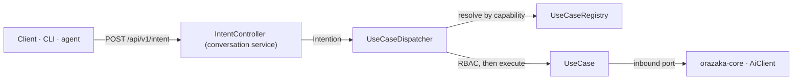

# Business Layer

> 🤖 **Generated from code** by `scripts/generate-docs.mjs` — do not hand-edit. Run `orazaka docs build` to refresh.

`orazaka-business` (repository `orazaka-ai-engine`) is the **App Factory** of the engine: the layer that decides
*what* a request is for, never *how* a model answers it. Every request a client sends becomes one immutable
`Intention`; the `UseCaseDispatcher` resolves it to the `UseCase` that serves its capability, checks the
use-case's RBAC policy against the actor's authorities and runs it. A use-case coordinates the core's inbound
ports (`AiClient`, the Studio run API…) and holds no model logic — that stays in `orazaka-core` and the
interceptor pipeline.



> **Use-cases are not packs.** A use-case is a technical entry point of the engine, written in Java. The
> business offers customers install — Studios, grouped in packs — are data: see [Packs & Studios](PACKS.md).

## Where things live

Ports & adapters, the same layout in every Orazaka module: `api` is the contract other modules may import,
`application` implements it, `domain` holds the model and the ports, and the use-cases are plain classes
discovered by Spring — adding one changes neither the core nor the router.

| Package | Type | Kind | Role |
|:---|:---|:---|:---|
| `.` | `BusinessAutoConfiguration` | class | Spring Boot auto-configuration for the orazaka-business module — the App Factory wiring. |
| `api` | `AgentPayload` | record | Payload for a `Capability#AGENT` intention — a goal the core's agent loop will plan and execute (plan→act→observe). |
| `api` | `Capability` | enum | The high-level capability an `Intention` targets. |
| `api` | `ChatPayload` | record | Payload for a `Capability#CHAT` intention. |
| `api` | `ExecutionMode` | enum | Execution mode of an `Intention`: `SYNC` for low-latency interactive responses (including token streaming), `ASYNC` for heavy/deferred work dispatched to a worker. |
| `api` | `ImagePayload` | record | Payload for a `Capability#IMAGE` intention. |
| `api` | `Intention` | record | The immutable entry unit of the platform — the single thing the router translates transport into and hands to the `UseCaseDispatcher`. |
| `api` | `IntentionContext` | record | Ambient context of an `Intention`: the conversation session, the acting principal (opaque `actorId` — no cross-context identity coupling), the actor's resolved authorities (for RBAC), and resolved preferences / environment signals. |
| `api` | `IntentionType` | enum | CQRS pivot of an `Intention`: `COMMAND` mutates state, `QUERY` only reads. |
| `api` | `Payload` | interface | Sealed hierarchy of the typed payloads an `Intention` can carry. |
| `api` | `PlanningMode` | enum | How a use-case resolves its execution plan: `DETERMINISTIC` runs a fixed workflow (DAG), `AGENTIC` delegates planning to the core's agent loop (plan→act→observe). |
| `api` | `RbacPolicy` | record | RBAC requirement a `UseCaseDescriptor` declares: the authorities an actor must hold to run the use-case. |
| `api` | `StudioPayload` | record | Payload for a `Capability#STUDIO` intention — one run of an installed Studio (ADR-034). |
| `api` | `UseCase` | interface | SPI extension point — adding a product capability means implementing a `UseCase` and declaring its `UseCaseDescriptor`. |
| `api` | `UseCaseContext` | record | Execution context handed to a `UseCase`, derived by the dispatcher from the `Intention` and the resolved security context. |
| `api` | `UseCaseDescriptor` | record | Metadata describing a `UseCase` — the metadata-driven contract the `UseCaseRegistry` matches intentions against and the auto-docs surface. |
| `api` | `UseCaseDispatcher` | interface | Inbound port — the single entry the router calls after translating transport into an `Intention`. |
| `api` | `UseCasePayload` | interface | Marker for a typed input accepted by a `UseCase`. |
| `api` | `UseCaseRegistry` | interface | Inbound port — the auto-discovered catalogue of registered `UseCase`s. |
| `api` | `UseCaseResolutionException` | class | Thrown by the `UseCaseDispatcher` when an `Intention` cannot be served — no registered `UseCase` matches it (ERR-410) or RBAC denies the actor (ERR-403). |
| `application` | `SpringUseCaseRegistry` | class | Auto-discovering `UseCaseRegistry`: it is handed every `UseCase` bean registered in the context and resolves an `Intention` to the first use-case whose descriptor serves the intention's capability. |
| `application` | `UseCaseDispatcherImpl` | class | App-Factory dispatcher: resolves an `Intention` to its `UseCase` via the `UseCaseRegistry`, enforces the descriptor's RBAC against the actor's authorities, then executes the use-case with a context derived from the intention. |
| `domain/model` | `WorkflowContext` | record | Rich, self-validating domain context for Workflow orchestration. |
| `domain/port` | `WorkflowOrchestrator` | interface | Business-owned port interface for sovereign workflow orchestration. |
| `prompt` | `MarkdownPromptResolver` | class | Thread-safe, cached resolver for Git-tracked Markdown prompt templates. |
| `usecases/chat` | `ChatAssistantUseCase` | class | Reference use-case — a synchronous chat assistant. |
| `usecases/image` | `ImageGenerationUseCase` | class | Second reference use-case — image generation. |
| `usecases/studio` | `StudioRunUseCase` | class | Runs an installed Studio as a first-class `Intention` (ADR-034 §9.2). |

## The contract

### `Intention`

The immutable entry unit of the platform — the single thing the router translates transport into and hands to the `UseCaseDispatcher`.

| Field | Type | Meaning |
|:---|:---|:---|
| `id` | `String` | Correlation id (auto-generated when absent) — used for observability. |
| `type` | `IntentionType` | CQRS pivot (COMMAND mutates, QUERY reads). |
| `mode` | `ExecutionMode` | SYNC (interactive) or ASYNC (deferred to a worker). |
| `capability` | `Capability` | The targeted capability. |
| `goal` | `String` | Short human/business statement of intent. |
| `payload` | `Payload` | The typed payload (required). |
| `context` | `IntentionContext` | Ambient session/actor/preferences context (required). |

### `IntentionContext`

Ambient context of an `Intention`: the conversation session, the acting principal (opaque `actorId` — no cross-context identity coupling), the actor's resolved authorities (for RBAC), and resolved preferences / environment signals.

| Field | Type | Meaning |
|:---|:---|:---|
| `sessionId` | `String` | Conversation/session id (may be null for one-shot intentions). |
| `actorId` | `String` | Opaque actor reference resolved by the router from the security context. |
| `authorities` | `Set<String>` | The actor's granted authorities; never null. |
| `preferences` | `Map<String, Object>` | Resolved user preferences and environment signals; never null. |

### `UseCaseDescriptor`

Metadata describing a `UseCase` — the metadata-driven contract the `UseCaseRegistry` matches intentions against and the auto-docs surface.

| Field | Type | Meaning |
|:---|:---|:---|
| `id` | `String` | Stable use-case id (required, non-blank). |
| `capability` | `Capability` | The capability this use-case serves (required). |
| `personas` | `Set<String>` | Persona keys whose prompt fragments apply; never null. |
| `planning` | `PlanningMode` | Deterministic workflow vs delegated agentic planning (required). |
| `requiredTools` | `Set<String>` | Tool ids the use-case needs available; never null. |
| `rbac` | `RbacPolicy` | RBAC policy gating execution (required). |

### `UseCaseContext`

Execution context handed to a `UseCase`, derived by the dispatcher from the `Intention` and the resolved security context.

| Field | Type | Meaning |
|:---|:---|:---|
| `intentionId` | `String` | Correlation id of the originating intention. |
| `actorId` | `String` | Opaque acting principal reference. |
| `sessionId` | `String` | Conversation/session id (may be null). |
| `authorities` | `Set<String>` | The actor's granted authorities (for RBAC); never null. |
| `preferences` | `Map<String, Object>` | Resolved preferences / environment signals; never null. |

### `RbacPolicy`

RBAC requirement a `UseCaseDescriptor` declares: the authorities an actor must hold to run the use-case.

| Field | Type | Meaning |
|:---|:---|:---|
| `requiredAuthorities` | `Set<String>` | Authorities the actor must hold (empty = permit all); never null. |

| Enum | Values | Meaning |
|:---|:---|:---|
| `Capability` | `CHAT` · `IMAGE` · `AUDIO` · `VIDEO` · `AGENT` · `ADMIN` · `STUDIO` | The high-level capability an `Intention` targets. |
| `ExecutionMode` | `SYNC` · `ASYNC` | Execution mode of an `Intention`: `SYNC` for low-latency interactive responses (including token streaming), `ASYNC` for heavy/deferred work dispatched to a worker. |
| `IntentionType` | `COMMAND` · `QUERY` | CQRS pivot of an `Intention`: `COMMAND` mutates state, `QUERY` only reads. |
| `PlanningMode` | `DETERMINISTIC` · `AGENTIC` | How a use-case resolves its execution plan: `DETERMINISTIC` runs a fixed workflow (DAG), `AGENTIC` delegates planning to the core's agent loop (plan→act→observe). |

## Use-cases

The registry matches an intention to the **first** use-case whose descriptor serves its capability.

| Use-case | Id | Capability | Planning | Personas | Required tools | RBAC | Summary |
|:---|:---|:---|:---|:---|:---|:---|:---|
| `ChatAssistantUseCase` | `chat.assistant` | CHAT | DETERMINISTIC | `personas/default-assistant` | — | anyone authenticated | Reference use-case — a synchronous chat assistant. |
| `ImageGenerationUseCase` | `image.generate` | IMAGE | DETERMINISTIC | — | — | anyone authenticated | Second reference use-case — image generation. |
| `StudioRunUseCase` | `studio.run` | STUDIO | DETERMINISTIC | — | — | anyone authenticated | Runs an installed Studio as a first-class `Intention` (ADR-034 §9.2). |

Dispatch refuses an intention with:

| Code | When |
|:---|:---|
| `ERR-410` | no use-case registered for capability |
| `ERR-403` | actor not authorized for use-case |

## Entry points

The adapters that hand work to the business layer:

| Adapter | Repository | Role |
|:---|:---|:---|
| `IntentController` | `orazaka-conversation-service` | REST controller for the `intent` resource. |
| `WorkflowAdapter` | `orazaka-conversation-service` | Router adapter translating the Business layer's `WorkflowContext` into the Core infrastructure's `Context` and `ChatRequest`. |

Call it over HTTP through the edge with a session token (see the [API reference](API_REFERENCE.md)):

```bash
curl -X POST http://localhost:8088/api/v1/intent \
  -H "Authorization: Bearer $TOKEN" -H "Content-Type: application/json" \
  -d '{"capability":"CHAT","prompt":"Summarise our refund policy in three bullet points."}'
```

## Adding a use-case

A new product capability is one class: implement `UseCase<I, R>`, declare its `UseCaseDescriptor`
(id, capability, personas, planning mode, required tools, RBAC) and register it as a bean — the registry
discovers it. Personas are Markdown prompts read from `classpath:prompts/<name>.md` by
`MarkdownPromptResolver`. The reference implementation, verbatim:

```java
package com.krizaka.orazaka.business.usecases.chat;

/**
 * Reference use-case — a synchronous chat assistant. Demonstrates the App Factory contract: it
 * declares a {@link UseCaseDescriptor} (with a markdown {@code persona}), resolves the persona via
 * {@link MarkdownPromptResolver}, and orchestrates the core's {@link AiClient} inbound port. A new
 * product capability is added the same way — a new {@code UseCase} class — without touching the
 * core or the router.
 */
public final class ChatAssistantUseCase implements UseCase<ChatPayload, ChatResponse> {

  private static final UseCaseDescriptor DESCRIPTOR =
      new UseCaseDescriptor(
          "chat.assistant",
          Capability.CHAT,
          Set.of("personas/default-assistant"),
          PlanningMode.DETERMINISTIC,
          Set.of(),
          RbacPolicy.PERMIT_ALL);

  private final AiClient aiClient;
  private final MarkdownPromptResolver prompts;

  public ChatAssistantUseCase(AiClient aiClient, MarkdownPromptResolver prompts) {
    this.aiClient = Objects.requireNonNull(aiClient, "aiClient must not be null");
    this.prompts = Objects.requireNonNull(prompts, "prompts must not be null");
  }

  @Override
  public UseCaseDescriptor descriptor() {
    return DESCRIPTOR;
  }

  @Override
  public ChatResponse execute(UseCaseContext ctx, ChatPayload input) {
    Context coreContext =
        new Context(
            ctx.actorId() != null ? ctx.actorId() : "anonymous",
            ctx.sessionId() != null ? ctx.sessionId() : ctx.intentionId(),
            ctx.preferences(),
            Set.of());
    return aiClient.chat(new ChatRequest(input.prompt(), personaMessages(), Map.of(), coreContext));
  }

  /** Resolves each declared persona's markdown into a leading system message. */
  private List<ChatMessage> personaMessages() {
    return descriptor().personas().stream()
        .map(prompts::resolve)
        .flatMap(java.util.Optional::stream)
        .filter(content -> !content.isBlank())
        .map(content -> new ChatMessage("system", content))
        .toList();
  }
}
```
